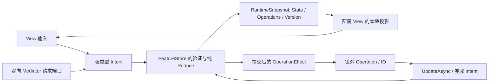

# MiKiNuo.Mvi

面向复杂业务 UI 与实时交互的 MVI v2 框架，目标为 .NET 10，支持 Avalonia 与 Godot。普通业务由不可变 State、独立 Feature 和平台 View 组成；框架生成输入回写、操作入口、命令、本地投影、请求处理端口与标准 DI 工厂。

当前默认分支 `codex/mvi-v2` 只保留 v2 运行协议。v1 位于 `main` 和固定归档 `archive/v1-2026-10-01`（`ed77eb38ecba77a62fac2c0cbbbb35321a540d03`），可以独立恢复用于历史调查和性能对照。

## 状态与业务流程



每个 Feature 实例有独立状态、操作身份、准入与生命期。IO 使用启动时通过验证的输入快照；反馈以提交时的当前 State 做纯转换，保留期间的新编辑。状态与操作事实提交到同一个带版本的 `RuntimeSnapshot<TState>`；正常等待完成表示有关状态已提交，UI 绘制独立调度。

默认拒绝同操作重复启动；Latest 拒绝旧执行的迟到反馈，Queue 有界顺序处理，Parallel 明确限制并行度。执行结果区分完成、拒绝、取消、被取代和故障，业务失败仍可属于正常完成。

完整子 Feature 可以独立复用、同类型多开和动态组合。跨 Feature 业务交互经 `Mediator` 定向投递；`SendAsync` 等待目标处理，`Post` 返回接纳及相关处理结果。View 卸载释放本地连接，实例由所有者关闭；逻辑关闭和真实资源释放分别观察。

## 三个安装入口

| 包 | 使用场景 |
| --- | --- |
| `MiKiNuo.Mvi` | 无 GUI 的业务宿主、运行时与组合；唯一携带生成器 analyzer |
| `MiKiNuo.Mvi.Avalonia` | Avalonia 平台适配，转递 Core 与其生成资产 |
| `MiKiNuo.Mvi.Godot` | Godot 平台适配，转递 Core 与其生成资产 |

应用显式引用自己的平台入口包，并自行提供平台宿主、主题或 Godot SDK。生成器不进入运行依赖；双平台引用只加载一份框架生成器。仓库消费者 fixture 验证这三个包的真实内容与转递关系。

```powershell
dotnet add package MiKiNuo.Mvi.Avalonia --version <已发布版本>
```

当前仓库包含完整的本地产物构建和独立消费门禁；远程发布由发行工作流显式执行。

## 业务作者示例

以下结构对应 [登录 State](sample/MiKiNuo.Mvi.Samples.Avalonia/Features/V2Auth/LoginState.cs) 与 [登录 Feature](sample/MiKiNuo.Mvi.Samples.Avalonia/Features/V2Auth/LoginFeature.cs)：

```csharp
public sealed record LoginState
{
    [Input]
    public string UserName { get; init; } = string.Empty;
    [Input]
    public string Password { get; init; } = string.Empty;
    public AuthResult? Result { get; init; }
    public string? ValidationError => string.IsNullOrWhiteSpace(UserName)
        || string.IsNullOrWhiteSpace(Password) ? "请输入用户名和密码。" : null;
}

public sealed partial class LoginFeature(IAuthService service) : Feature<LoginState>(new())
{
    [Operation(Validate = nameof(CanSubmit))]
    private async Task<AuthResult> SubmitAsync(Operation<LoginState> operation)
    {
        LoginState input = operation.Snapshot;
        AuthResult result = await service.LoginAsync(
            input.UserName, input.Password, operation.CancellationToken);
        operation.CancellationToken.ThrowIfCancellationRequested();
        await operation.UpdateAsync(ApplyResult, result);
        return result;
    }

    private static bool CanSubmit(LoginState state) => state.ValidationError is null;
    private static LoginState ApplyResult(LoginState state, AuthResult result)
        => state with { Result = result };
}
```

`AuthResult` 与 `IAuthService` 属于应用。输入字段生成 `SetUserName`、`SetPassword` 和投影的可编辑属性；操作生成可等待的 `SubmitAsync(CancellationToken)` 与投影的 `SubmitAsyncCommand`。`Feature<TState>` 子类型直接参与生成，不需要另加 Feature 标记属性。

View 使用平台本地连接。Avalonia 调用 `AvaloniaProjection.Create(feature.CreateProjection)` 和 `BindInput`；Godot 使用 `GodotProjection`、原生信号及 `GodotFeatureHost`。View 不持有其他 Feature 的状态或业务实现，输入、程序调用和请求端口都遵循目标实例的启动验证。

## 本地运行与验收

```powershell
dotnet build MiKiNuo.Mvi.slnx -c Release
dotnet test --solution MiKiNuo.Mvi.slnx -c Release --no-build
dotnet run --project sample/MiKiNuo.Mvi.Samples.Avalonia -c Release --no-build
```

默认 Avalonia 窗口是登录、注册和重置密码三个 v2 表单，联网服务沿用 DummyJSON 示例。`--v2-input`、`--v2-search`、`--v2-remount`、`--v2-workspace` 选择输入、Latest 搜索、重挂载或组合演示；对应 `--verify-v2-*` 使用真实窗口与可控服务作确定性验收。

Godot 示例包含 HUD 和 `Composition.tscn`，使用固定 Godot 4.6.2 .NET 引擎。宿主为 Godot.NET.Sdk 4.6.1，明确将 GodotSharp 与源生成器的解析版本设为 4.6.2，目标保持 net10.0。

```powershell
pwsh -NoProfile -File scripts/pack-local.ps1 -Version 2.0.0-local.1 -GodotPath <Godot-4.6.2-console.exe>
```

该入口执行解决方案构建/测试，再 fresh Rebuild 三包，在仓库外隔离 feed/cache 中验证 Core、Avalonia、Godot、双平台四个消费者、真实双平台场景及 20 个原声明诊断案例。经过验证的包与证据写入 `artifacts/packages/<version>/`。Shell 包装为 `scripts/pack-local.sh <version>`，也使用 PowerShell 7.2+ 的同一入口。

正式、preview 与 CI 共用该入口和唯一三包清单。普通 `windows-latest` 运行 `-NonGraphical`，只证明消费者构建、Core/Dual 执行和诊断资产，结果明确为 `PASS_NON_GRAPHICAL`；真实 GUI 验收由完整本地入口提供。详见 [消费者说明](test/MiKiNuo.Mvi.PackageConsumers/README.md)。

## 当前文档与边界

- [领域词汇](docs/mvi-next/CONTEXT.md) 是活跃术语的权威定义。
- [已实现架构](docs/mvi-next/ARCHITECTURE.md) 和 [UML / 时序 / 数据流](docs/mvi-next/diagrams/README.md) 对应当前运行协议。
- [实施规格](docs/mvi-next/SPEC.md) 定义 T01–T21 与性能验收；[任务看板](docs/mvi-next/TICKETS.md) 记录进度。
- [工程指南](AGENTS.md) 说明代码、测试与打包约束；历史决定保留在 [ADR](docs/adr/)。

功能与包消费通过不等于性能目标达成。派发、资源、多实例、真实 UI 与生成编译成本的固定负载测量由 21、22 任务提供，数值预算和回归结论以那些数据为准。
