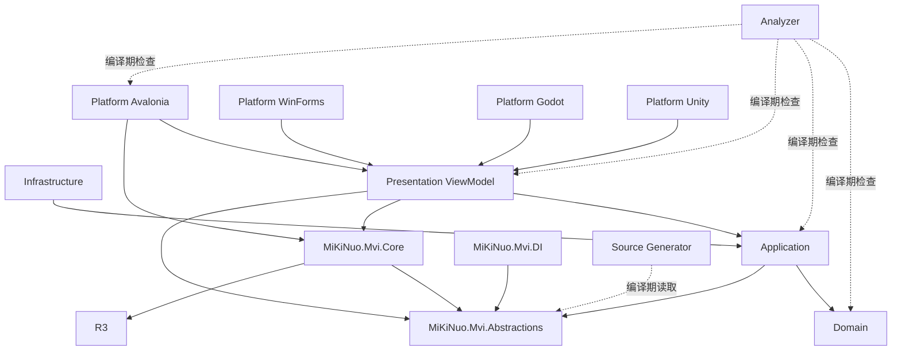
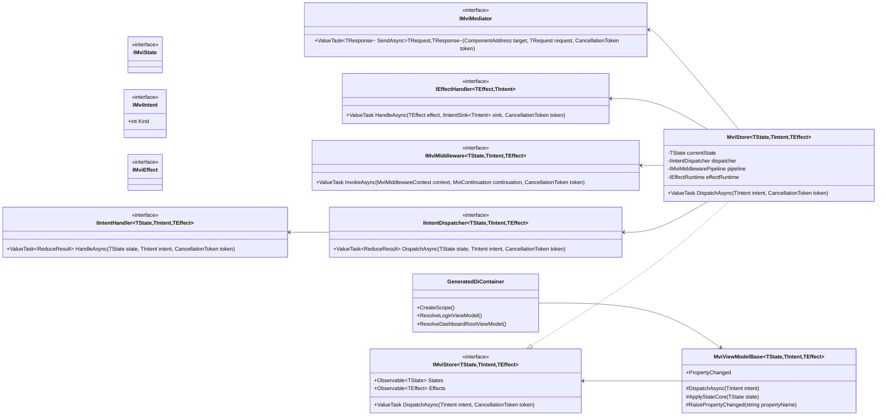
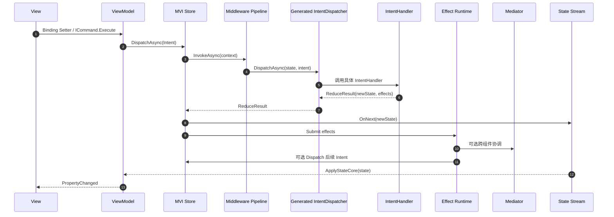
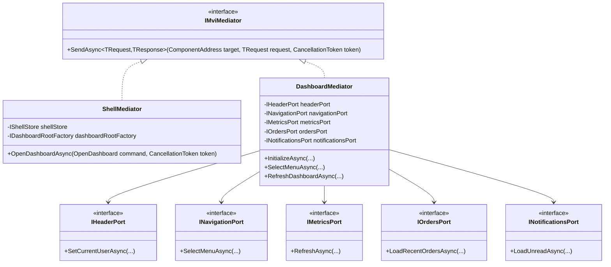
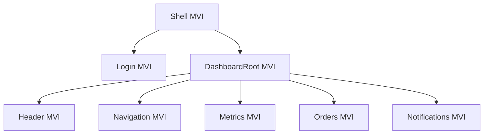
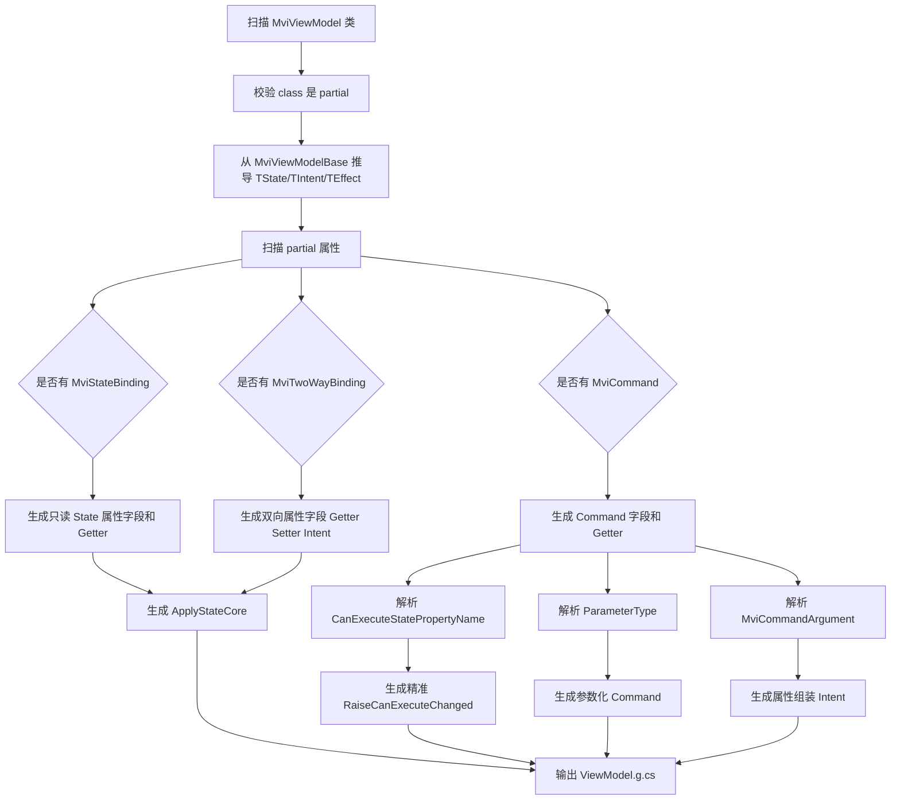
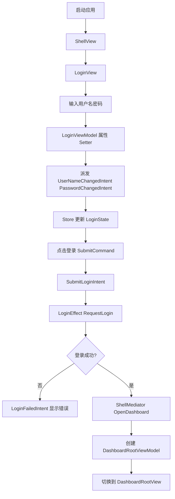
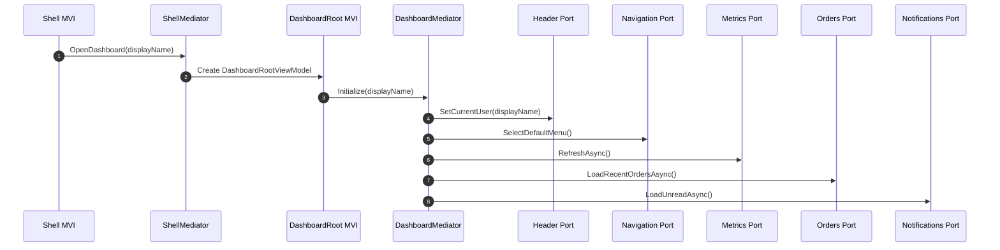
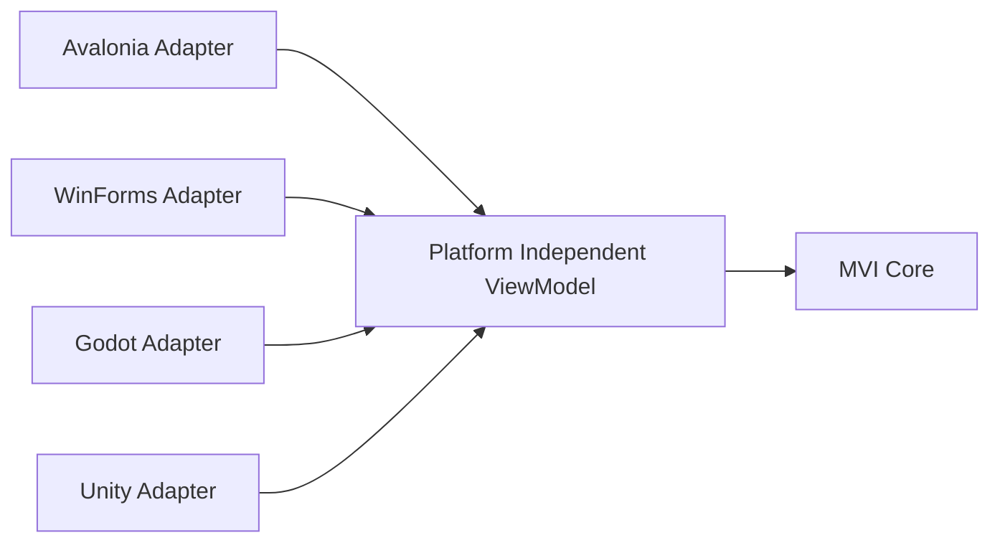

# MiKiNuo 响应式 MVI 架构与源生成 DI 架构设计文档

> 文档版本：v1.1  
> 更新日期：2026-05-01  
> 目标平台：.NET 10 / R3 / TUnit / Avalonia / WinForms / Godot / Unity  
> 核心目标：响应式 MVI、源生成 DI、Clean Architecture、零反射、高性能、跨平台、Analyzer 编译期强约束。  
> 重要更新：ViewModel 绑定设计已改为**属性级 / Command 级特性声明**。类上只保留 `[MviViewModel]`，不再把一堆绑定特性堆在类上。

---

## 目录

1. [架构总览](#1-架构总览)
2. [技术栈与版本基线](#2-技术栈与版本基线)
3. [核心设计原则](#3-核心设计原则)
4. [解决方案目录结构](#4-解决方案目录结构)
5. [Clean Architecture 分层设计](#5-clean-architecture-分层设计)
6. [总体 UML 架构图](#6-总体-uml-架构图)
7. [MVI 核心模型设计](#7-mvi-核心模型设计)
8. [单向数据流设计](#8-单向数据流设计)
9. [Store 设计](#9-store-设计)
10. [Intent 与 Handler 设计](#10-intent-与-handler-设计)
11. [Reducer 大量 switch 的解决方案](#11-reducer-大量-switch-的解决方案)
12. [Middleware 中间件设计](#12-middleware-中间件设计)
13. [Side Effect 副作用处理设计](#13-side-effect-副作用处理设计)
14. [真正的 Mediator 设计](#14-真正的-mediator-设计)
15. [组合式 View 与组件树设计](#15-组合式-view-与组件树设计)
16. [新版 ViewModel 绑定模型设计](#16-新版-viewmodel-绑定模型设计)
17. [多属性、多 Command ViewModel 设计](#17-多属性多-command-viewmodel-设计)
18. [源生成 DI 架构设计](#18-源生成-di-架构设计)
19. [Source Generator 设计](#19-source-generator-设计)
20. [Analyzer 编译期规则设计](#20-analyzer-编译期规则设计)
21. [Avalonia 示例应用设计](#21-avalonia-示例应用设计)
22. [Dashboard 复杂组合界面设计](#22-dashboard-复杂组合界面设计)
23. [跨平台适配设计](#23-跨平台适配设计)
24. [TDD 与测试架构](#24-tdd-与测试架构)
25. [编码规范与中文注释规则](#25-编码规范与中文注释规则)
26. [关键代码骨架](#26-关键代码骨架)
27. [项目落地路线图](#27-项目落地路线图)
28. [风险点与约束](#28-风险点与约束)
29. [最终结论](#29-最终结论)

---

# 1. 架构总览

本方案设计一套适用于 `.NET 10` 的响应式 MVI 架构框架，同时设计一套专门服务于该 MVI 架构的源生成 DI 框架。

整体目标不是简单封装几个 ViewModel 和 Command，而是形成一套完整基础设施：

- **MVI Core**：State、Intent、Effect、Store、Middleware、Effect Runtime、Intent Dispatcher。
- **Generated DI**：基于 Source Generator 的高性能依赖注入容器。
- **Generated Binding**：自动生成 ViewModel 状态属性、双向绑定属性、Command 属性、构造函数、`ApplyStateCore`。
- **Generated Intent Dispatcher**：避免 Reducer 或 IntentHandler 入口出现大量 `switch`。
- **Generated Mediator Route**：真正的中介者路由，不做 EventBus，不做全局订阅中心。
- **Generated View Registry**：View 与 ViewModel 编译期映射，禁止运行时反射。
- **Analyzers**：Clean Architecture、微软编码规范、中文注释、禁止反射、禁止 ReactiveUI/System.Reactive、View/ViewModel 职责边界。
- **Platform Adapters**：Avalonia、WinForms、Godot、Unity 等平台只做视图适配。

核心目标：

```text
View 只负责绑定
ViewModel 只负责暴露绑定属性和命令
Store 负责状态流转
IntentHandler 负责状态归约
EffectHandler 负责副作用
Mediator 负责组件间协调
Source Generator 负责所有重复样板代码
Analyzer 负责把架构规则变成编译期错误
```

本版本最重要的 ViewModel 设计结论：

```text
类上只标记 [MviViewModel]
普通绑定属性上标记 [MviStateBinding]
双向绑定属性上标记 [MviTwoWayBinding]
Command 属性上标记 [MviCommand]
复杂 Command 参数映射写在对应 Command 属性上
```

---

# 2. 技术栈与版本基线

| 类别 | 建议版本 | 说明 |
|---|---:|---|
| .NET | net10.0 | 主目标框架 |
| C# | C# 14 | 配合 .NET 10 |
| R3 | 1.3.0 | 唯一响应式基础库 |
| TUnit | 0.81.0 | 测试框架，支持源生成测试思路 |
| Avalonia | 12.0.2 | 第一个平台示例 |
| Roslyn | 与 .NET SDK 匹配 | Source Generator 与 Analyzer |

版本原则：

1. 核心库只依赖 `.NET` 与 `R3`。
2. 测试层只依赖 `TUnit`。
3. 平台层才允许依赖 `Avalonia`、`WinForms`、`Godot`、`Unity`。
4. 严格禁止引入 `ReactiveUI`、`System.Reactive` 等第三方响应式库。
5. 严格禁止运行时反射创建 ViewModel、View、Handler、Service。
6. 所有版本通过 `Directory.Packages.props` 统一管理，避免项目之间版本漂移。

示例 `Directory.Packages.props`：

```xml
<Project>
  <ItemGroup>
    <PackageVersion Include="R3" Version="1.3.0" />
    <PackageVersion Include="TUnit" Version="0.81.0" />
    <PackageVersion Include="Avalonia" Version="12.0.2" />
    <PackageVersion Include="Avalonia.Desktop" Version="12.0.2" />
    <PackageVersion Include="Avalonia.Themes.Fluent" Version="12.0.2" />
    <PackageVersion Include="Avalonia.Fonts.Inter" Version="12.0.2" />
    <PackageVersion Include="Microsoft.CodeAnalysis.CSharp" Version="latest-compatible" />
  </ItemGroup>
</Project>
```

---

# 3. 核心设计原则

## 3.1 单向数据流

```text
View -> ViewModel -> Intent -> Store -> Middleware -> IntentHandler -> State/Effect -> ViewModel -> View
```

所有状态变化必须通过 Intent 进入 Store。ViewModel 不允许直接修改业务状态。

## 3.2 View 与 ViewModel 职责分离

| 对象 | 允许做什么 | 禁止做什么 |
|---|---|---|
| View | XAML/控件绑定、布局、样式 | 调业务服务、写状态逻辑、引用其他组件 ViewModel |
| ViewModel | 暴露属性、暴露 ICommand、转发 Intent | 引用 UI 控件、写业务逻辑、直接调 HTTP/DB |
| Store | 管理状态流、执行中间件管道、派发 Effect | 直接操作 UI |
| IntentHandler | 纯状态转换，返回 ReduceResult | 直接做 IO |
| EffectHandler | 执行异步副作用、派发后续 Intent | 修改 View |
| Mediator | 组件间协调 | 事件广播、全局订阅中心 |

## 3.3 编译期优先

运行期性能优化核心思路：

- 不扫程序集。
- 不用反射创建对象。
- 不用字符串查找 Handler。
- 不用运行时 Attribute 读取。
- 不用 EventBus 式广播。
- 不让 ViewModel 手写重复命令和属性。
- 通过 Source Generator 生成 DI、Intent Dispatcher、ViewModel Binding、Mediator Route、View Registry。

## 3.4 TDD 优先

每个核心模块先写测试：

```text
先写测试 -> 再写接口 -> 再写最小实现 -> 再加 Source Generator -> 再加 Analyzer 约束
```

---

# 4. 解决方案目录结构

```text
MiKiNuo.Mvi/
├─ Directory.Build.props
├─ Directory.Packages.props
├─ .editorconfig
├─ MiKiNuo.Mvi.sln
│
├─ src/
│  ├─ MiKiNuo.Mvi.Abstractions/
│  │  ├─ Intent/
│  │  ├─ State/
│  │  ├─ Effects/
│  │  ├─ Mediator/
│  │  ├─ DependencyInjection/
│  │  ├─ Binding/
│  │  └─ Platform/
│  │
│  ├─ MiKiNuo.Mvi.Core/
│  │  ├─ Store/
│  │  ├─ Middleware/
│  │  ├─ Reducers/
│  │  ├─ Effects/
│  │  ├─ Commands/
│  │  └─ Binding/
│  │
│  ├─ MiKiNuo.Mvi.DI/
│  │  ├─ Lifetime/
│  │  ├─ Scope/
│  │  ├─ Factories/
│  │  └─ Runtime/
│  │
│  ├─ MiKiNuo.Mvi.SourceGen/
│  │  ├─ Di/
│  │  ├─ Mvi/
│  │  ├─ ViewModel/
│  │  ├─ ViewRegistry/
│  │  └─ Mediator/
│  │
│  ├─ MiKiNuo.Mvi.Analyzers/
│  │  ├─ CleanArchitecture/
│  │  ├─ CodingStyle/
│  │  ├─ Documentation/
│  │  ├─ NoReflection/
│  │  ├─ MviRules/
│  │  └─ AnalyzerReleases.Shipped.md
│  │
│  ├─ MiKiNuo.Mvi.Platforms.Avalonia/
│  │  ├─ Views/
│  │  ├─ Binding/
│  │  ├─ Slots/
│  │  ├─ ViewRegistry/
│  │  └─ Controls/
│  │
│  ├─ MiKiNuo.Mvi.Platforms.WinForms/
│  ├─ MiKiNuo.Mvi.Platforms.Godot/
│  └─ MiKiNuo.Mvi.Platforms.Unity/
│
├─ sample/
│  └─ MiKiNuo.Mvi.Samples.Avalonia/
│     ├─ App.axaml
│     ├─ App.axaml.cs
│     ├─ Program.cs
│     ├─ Features/
│     │  ├─ Shell/
│     │  ├─ Login/
│     │  └─ Dashboard/
│     │     ├─ Root/
│     │     ├─ Header/
│     │     ├─ Navigation/
│     │     ├─ Metrics/
│     │     ├─ Orders/
│     │     └─ Notifications/
│     └─ Generated/
│
└─ tests/
   ├─ MiKiNuo.Mvi.Core.Tests/
   ├─ MiKiNuo.Mvi.DI.Tests/
   ├─ MiKiNuo.Mvi.SourceGen.Tests/
   ├─ MiKiNuo.Mvi.Analyzers.Tests/
   └─ MiKiNuo.Mvi.Samples.Avalonia.Tests/
```

---

# 5. Clean Architecture 分层设计

## 5.1 分层职责

| 层 | 项目 | 职责 |
|---|---|---|
| Domain | 业务领域项目 | 领域实体、值对象、领域服务、领域事件 |
| Application | 用例项目 | UseCase、Port、业务编排、Intent/State/Effect 定义 |
| MVI Abstractions | `MiKiNuo.Mvi.Abstractions` | 框架契约、Attribute、接口 |
| MVI Core | `MiKiNuo.Mvi.Core` | Store、Middleware、Command、Effect Runtime |
| DI Runtime | `MiKiNuo.Mvi.DI` | Scope、生命周期、生成容器运行时基础 |
| Infrastructure | 基础设施项目 | DB、HTTP、文件、第三方 API 实现 |
| Presentation | 平台无关 ViewModel | ViewModel 绑定契约 |
| Platform | Avalonia/WinForms/Godot/Unity | View、平台绑定适配、控件封装 |
| SourceGen | `MiKiNuo.Mvi.SourceGen` | 编译期生成重复代码 |
| Analyzer | `MiKiNuo.Mvi.Analyzers` | 编译期强约束 |

## 5.2 项目依赖规则



## 5.3 禁止引用规则

| 当前层 | 禁止引用 |
|---|---|
| Domain | Infrastructure、Avalonia、WinForms、Godot、Unity、DI Runtime |
| Application | Avalonia、WinForms、Godot、Unity、Infrastructure 实现 |
| Core | Avalonia、WinForms、Godot、Unity、ReactiveUI、System.Reactive |
| Presentation | UI 控件类型、HTTP/DB/File 具体实现 |
| Platform | 业务 Infrastructure 细节 |
| SourceGen | 业务运行时实现 |

这些规则由 Analyzer 在编译期强制执行，不满足直接编译错误。

---

# 6. 总体 UML 架构图



---

# 7. MVI 核心模型设计

## 7.1 State

State 是 UI 状态快照，建议使用不可变 record。

```csharp
namespace MiKiNuo.Mvi.Abstractions;

/// <summary>
/// 表示 MVI 状态标记接口。
/// </summary>
public interface IMviState
{
}
```

## 7.2 Intent

Intent 表示用户意图或系统意图。

```csharp
namespace MiKiNuo.Mvi.Abstractions;

/// <summary>
/// 表示 MVI 意图标记接口。
/// </summary>
public interface IMviIntent
{
    /// <summary>
    /// 获取由源生成器分配的意图编号。
    /// </summary>
    int Kind { get; }
}
```

## 7.3 Effect

Effect 表示副作用描述，不直接执行副作用。

```csharp
namespace MiKiNuo.Mvi.Abstractions;

/// <summary>
/// 表示 MVI 副作用标记接口。
/// </summary>
public interface IMviEffect
{
}
```

## 7.4 ReduceResult

避免在泛型类型上放静态成员，规避 CA1000。

```csharp
namespace MiKiNuo.Mvi.Core.Reducers;

/// <summary>
/// 表示状态归约结果。
/// </summary>
/// <typeparam name="TState">状态类型。</typeparam>
/// <typeparam name="TEffect">副作用类型。</typeparam>
/// <param name="State">新的状态。</param>
/// <param name="Effects">需要提交的副作用集合。</param>
public readonly record struct ReduceResult<TState, TEffect>(
    TState State,
    IReadOnlyList<TEffect> Effects);

/// <summary>
/// 提供状态归约结果的创建方法。
/// </summary>
public static class ReduceResults
{
    /// <summary>
    /// 创建无副作用的归约结果。
    /// </summary>
    public static ReduceResult<TState, TEffect> StateOnly<TState, TEffect>(TState state)
    {
        return new ReduceResult<TState, TEffect>(state, Array.Empty<TEffect>());
    }

    /// <summary>
    /// 创建包含单个副作用的归约结果。
    /// </summary>
    public static ReduceResult<TState, TEffect> WithEffect<TState, TEffect>(
        TState state,
        TEffect effect)
    {
        return new ReduceResult<TState, TEffect>(state, [effect]);
    }
}
```

---

# 8. 单向数据流设计



核心约束：

1. View 不直接改 State。
2. ViewModel Setter 只派发 Intent。
3. State 回流后才更新 ViewModel 字段。
4. IntentHandler 只处理状态归约。
5. EffectHandler 处理异步副作用。
6. Mediator 只处理明确的组件协调请求。

---

# 9. Store 设计

## 9.1 Store 接口

```csharp
namespace MiKiNuo.Mvi.Core.Store;

/// <summary>
/// 表示 MVI 状态容器。
/// </summary>
/// <typeparam name="TState">状态类型。</typeparam>
/// <typeparam name="TIntent">意图类型。</typeparam>
/// <typeparam name="TEffect">副作用类型。</typeparam>
public interface IMviStore<TState, TIntent, TEffect>
    where TState : IMviState
    where TIntent : IMviIntent
    where TEffect : IMviEffect
{
    /// <summary>
    /// 获取状态流。
    /// </summary>
    Observable<TState> States { get; }

    /// <summary>
    /// 获取副作用流。
    /// </summary>
    Observable<TEffect> Effects { get; }

    /// <summary>
    /// 派发意图。
    /// </summary>
    /// <param name="intent">意图。</param>
    /// <param name="cancellationToken">取消令牌。</param>
    /// <returns>异步任务。</returns>
    ValueTask DispatchAsync(TIntent intent, CancellationToken cancellationToken);
}
```

## 9.2 Store 实现要点

Store 负责：

- 保存当前 State。
- 暴露 State Observable。
- 接收 Intent。
- 进入 Middleware Pipeline。
- 调用 Generated IntentDispatcher。
- 发布新 State。
- 发布 Effect。

Store 不负责：

- 直接调用 UI。
- 直接调用 HTTP/DB。
- 直接跨组件通知。

---

# 10. Intent 与 Handler 设计

## 10.1 Intent Union

```csharp
namespace MiKiNuo.Mvi.Samples.Avalonia.Features.Login;

/// <summary>
/// 表示登录界面意图基类。
/// </summary>
[MviIntentUnion]
public abstract partial record LoginIntent : IMviIntent;

/// <summary>
/// 表示用户名变化意图。
/// </summary>
/// <param name="UserName">用户名。</param>
[MviIntentKind(0)]
public sealed partial record UserNameChangedIntent(string UserName) : LoginIntent;

/// <summary>
/// 表示提交登录意图。
/// </summary>
[MviIntentKind(1)]
public sealed partial record SubmitLoginIntent : LoginIntent;
```

## 10.2 一个 Intent 一个 Handler

```csharp
namespace MiKiNuo.Mvi.Samples.Avalonia.Features.Login;

/// <summary>
/// 处理用户名变化意图。
/// </summary>
[MviIntentHandler(typeof(UserNameChangedIntent))]
public sealed class UserNameChangedHandler
    : IIntentHandler<LoginState, UserNameChangedIntent, LoginEffect>
{
    /// <inheritdoc />
    public ValueTask<ReduceResult<LoginState, LoginEffect>> HandleAsync(
        LoginState state,
        UserNameChangedIntent intent,
        CancellationToken cancellationToken)
    {
        LoginState newState = state with
        {
            UserName = intent.UserName,
            ErrorMessage = null
        };

        return ValueTask.FromResult(
            ReduceResults.StateOnly<LoginState, LoginEffect>(newState));
    }
}
```

---

# 11. Reducer 大量 switch 的解决方案

不允许业务开发者写：

```csharp
switch (intent)
{
    case UserNameChangedIntent:
    case PasswordChangedIntent:
    case SubmitLoginIntent:
    // ...几十个 case
}
```

推荐方案：

```text
Intent 类型 -> 独立 IntentHandler -> Source Generator 生成 IntentDispatcher
```

生成器输出示例：

```csharp
// <auto-generated />
#nullable enable

namespace MiKiNuo.Mvi.Samples.Avalonia.Features.Login.Generated;

/// <summary>
/// Auto：由源生成器生成的登录意图分发器。
/// </summary>
internal sealed partial class LoginIntentDispatcher
    : IIntentDispatcher<LoginState, LoginIntent, LoginEffect>
{
    private readonly IIntentExecutor<LoginState, LoginIntent, LoginEffect>[] executors;

    /// <summary>
    /// 初始化登录意图分发器。
    /// </summary>
    public LoginIntentDispatcher(
        UserNameChangedHandler userNameChangedHandler,
        PasswordChangedHandler passwordChangedHandler,
        RememberMeChangedHandler rememberMeChangedHandler,
        SubmitLoginHandler submitLoginHandler,
        ClearLoginFormHandler clearLoginFormHandler,
        TogglePasswordVisibilityHandler togglePasswordVisibilityHandler,
        GuestLoginHandler guestLoginHandler)
    {
        executors =
        [
            new IntentExecutor<LoginState, LoginIntent, UserNameChangedIntent, LoginEffect>(userNameChangedHandler),
            new IntentExecutor<LoginState, LoginIntent, PasswordChangedIntent, LoginEffect>(passwordChangedHandler),
            new IntentExecutor<LoginState, LoginIntent, RememberMeChangedIntent, LoginEffect>(rememberMeChangedHandler),
            new IntentExecutor<LoginState, LoginIntent, SubmitLoginIntent, LoginEffect>(submitLoginHandler),
            new IntentExecutor<LoginState, LoginIntent, ClearLoginFormIntent, LoginEffect>(clearLoginFormHandler),
            new IntentExecutor<LoginState, LoginIntent, TogglePasswordVisibilityIntent, LoginEffect>(togglePasswordVisibilityHandler),
            new IntentExecutor<LoginState, LoginIntent, GuestLoginIntent, LoginEffect>(guestLoginHandler)
        ];
    }

    /// <inheritdoc />
    public ValueTask<ReduceResult<LoginState, LoginEffect>> DispatchAsync(
        LoginState state,
        LoginIntent intent,
        CancellationToken cancellationToken)
    {
        return executors[intent.Kind].ExecuteAsync(state, intent, cancellationToken);
    }
}
```

---

# 12. Middleware 中间件设计

## 12.1 中间件接口

```csharp
namespace MiKiNuo.Mvi.Core.Middleware;

/// <summary>
/// 表示 MVI 中间件上下文。
/// </summary>
/// <typeparam name="TState">状态类型。</typeparam>
/// <typeparam name="TIntent">意图类型。</typeparam>
/// <typeparam name="TEffect">副作用类型。</typeparam>
/// <param name="State">当前状态。</param>
/// <param name="Intent">当前意图。</param>
public sealed record MviMiddlewareContext<TState, TIntent, TEffect>(
    TState State,
    TIntent Intent)
    where TState : IMviState
    where TIntent : IMviIntent
    where TEffect : IMviEffect;

/// <summary>
/// 表示 MVI 中间件。
/// </summary>
public interface IMviMiddleware<TState, TIntent, TEffect>
    where TState : IMviState
    where TIntent : IMviIntent
    where TEffect : IMviEffect
{
    /// <summary>
    /// 执行中间件逻辑。
    /// </summary>
    ValueTask<ReduceResult<TState, TEffect>> InvokeAsync(
        MviMiddlewareContext<TState, TIntent, TEffect> context,
        MviContinuation<TState, TIntent, TEffect> continuation,
        CancellationToken cancellationToken);
}
```

注意参数使用 `continuation`，不要使用 `next`，避免 CA1716 语言关键字冲突。

## 12.2 常用中间件

| 中间件 | 职责 |
|---|---|
| LoggingMiddleware | 记录 Intent 与状态变化 |
| PerformanceMiddleware | 统计 Intent 耗时 |
| ExceptionMiddleware | 捕获异常并转换为 Effect |
| CancellationMiddleware | 取消过期 Intent |
| DeduplicateIntentMiddleware | 高频 Intent 去重 |
| AuthorizationMiddleware | 权限校验 |
| SchedulerMiddleware | 控制 UI/后台线程调度 |

---

# 13. Side Effect 副作用处理设计

Effect 是副作用描述，EffectHandler 执行副作用。

```csharp
namespace MiKiNuo.Mvi.Samples.Avalonia.Features.Login;

/// <summary>
/// 表示登录界面的副作用。
/// </summary>
public abstract record LoginEffect : IMviEffect
{
    /// <summary>
    /// 请求执行登录。
    /// </summary>
    /// <param name="UserName">用户名。</param>
    /// <param name="Password">密码。</param>
    public sealed record RequestLogin(string UserName, string Password) : LoginEffect;

    /// <summary>
    /// 请求跳转到仪表盘。
    /// </summary>
    /// <param name="DisplayName">显示名称。</param>
    public sealed record NavigateToDashboard(string DisplayName) : LoginEffect;
}
```

EffectHandler 示例：

```csharp
namespace MiKiNuo.Mvi.Samples.Avalonia.Features.Login;

/// <summary>
/// 处理登录请求副作用。
/// </summary>
public sealed class LoginEffectHandler
    : IEffectHandler<LoginEffect.RequestLogin, LoginIntent>
{
    private readonly ILoginService loginService;
    private readonly IShellMediator shellMediator;

    /// <summary>
    /// 初始化登录副作用处理器。
    /// </summary>
    public LoginEffectHandler(
        ILoginService loginService,
        IShellMediator shellMediator)
    {
        this.loginService = loginService;
        this.shellMediator = shellMediator;
    }

    /// <inheritdoc />
    public async ValueTask HandleAsync(
        LoginEffect.RequestLogin effect,
        IIntentSink<LoginIntent> sink,
        CancellationToken cancellationToken)
    {
        LoginResult result = await loginService.LoginAsync(
            effect.UserName,
            effect.Password,
            cancellationToken).ConfigureAwait(false);

        if (result.IsSuccess)
        {
            await shellMediator.SendAsync(
                ComponentAddress.Root,
                new ShellCommand.OpenDashboard(result.DisplayName),
                cancellationToken).ConfigureAwait(false);

            await sink.DispatchAsync(
                new LoginCompletedIntent(result.DisplayName),
                cancellationToken).ConfigureAwait(false);
        }
        else
        {
            await sink.DispatchAsync(
                new LoginFailedIntent(result.ErrorMessage),
                cancellationToken).ConfigureAwait(false);
        }
    }
}
```

---

# 14. 真正的 Mediator 设计

## 14.1 为什么不用 EventBus

事件总线常见问题：

```text
LoginSucceeded 被广播
Header 订阅
Dashboard 订阅
Navigation 订阅
Notifications 订阅
Orders 订阅
Metrics 订阅
```

结果是：

- 订阅爆炸。
- 处理链不可追踪。
- 组件依赖隐性化。
- 状态变化难定位。
- 大型界面越做越乱。

本方案采用真正的 Mediator：

```text
Login MVI -> ShellMediator.OpenDashboard
ShellMediator -> 创建 DashboardRoot
DashboardMediator -> 明确协调 Header / Navigation / Metrics / Orders / Notifications
```

## 14.2 Mediator 类图



## 14.3 Mediator 请求模型

```csharp
namespace MiKiNuo.Mvi.Core.Mediator;

/// <summary>
/// 表示组件地址。
/// </summary>
/// <param name="Value">组件地址值。</param>
public readonly record struct ComponentAddress(string Value)
{
    /// <summary>
    /// 获取根组件地址。
    /// </summary>
    public static readonly ComponentAddress Root = new("Root");
}

/// <summary>
/// 表示中介者请求。
/// </summary>
/// <typeparam name="TResponse">响应类型。</typeparam>
public interface IMediatorRequest<TResponse>
{
}

/// <summary>
/// 表示无返回值结果。
/// </summary>
public readonly record struct UnitResult;
```

---

# 15. 组合式 View 与组件树设计

## 15.1 组件树



## 15.2 Avalonia 组合插槽

```csharp
namespace MiKiNuo.Mvi.Platforms.Avalonia.Slots;

/// <summary>
/// 表示 MVI 组合视图插槽。
/// </summary>
public sealed class MviSlotHost : ContentControl
{
    /// <summary>
    /// 定义组件键属性。
    /// </summary>
    public static readonly StyledProperty<string?> ComponentKeyProperty =
        AvaloniaProperty.Register<MviSlotHost, string?>(nameof(ComponentKey));

    /// <summary>
    /// 获取或设置组件键。
    /// </summary>
    public string? ComponentKey
    {
        get => GetValue(ComponentKeyProperty);
        set => SetValue(ComponentKeyProperty, value);
    }
}
```

## 15.3 编译期 View Registry

```csharp
namespace MiKiNuo.Mvi.Platforms.Avalonia.ViewRegistry;

/// <summary>
/// 标记 Avalonia View 与 ViewModel 的绑定关系。
/// </summary>
[AttributeUsage(AttributeTargets.Class, Inherited = false)]
public sealed class MviAvaloniaViewAttribute : Attribute
{
    /// <summary>
    /// 初始化 Avalonia View 注册特性。
    /// </summary>
    public MviAvaloniaViewAttribute(string componentKey, Type viewModelType)
    {
        ComponentKey = componentKey;
        ViewModelType = viewModelType;
    }

    /// <summary>
    /// 获取组件键。
    /// </summary>
    public string ComponentKey { get; }

    /// <summary>
    /// 获取 ViewModel 类型。
    /// </summary>
    public Type ViewModelType { get; }
}
```

---

# 16. 新版 ViewModel 绑定模型设计

## 16.1 最终设计结论

ViewModel 不再在类上堆一堆绑定标签。最终设计为：

```text
[MviViewModel] 放在类上
[MviStateBinding] 放在只读状态属性上
[MviTwoWayBinding] 放在双向绑定属性上
[MviCommand] 放在 ICommand 属性上
[MviCommandArgument] 放在对应 ICommand 属性上
```

这带来几个好处：

1. 类头部干净。
2. 每个属性的绑定规则就在属性旁边。
3. 每个 Command 的 Intent 和 CanExecute 就在 Command 旁边。
4. 多属性、多命令不会让类声明越来越长。
5. Analyzer 可以更精准地检查属性类型、setter、Intent 构造函数、CanExecute 类型。

## 16.2 ViewModel 基类

```csharp
namespace MiKiNuo.Mvi.Core.Binding;

/// <summary>
/// 表示平台无关的 MVI ViewModel 基类。
/// </summary>
/// <typeparam name="TState">状态类型。</typeparam>
/// <typeparam name="TIntent">意图类型。</typeparam>
/// <typeparam name="TEffect">副作用类型。</typeparam>
public abstract class MviViewModelBase<TState, TIntent, TEffect>
    : INotifyPropertyChanged, IAsyncDisposable
    where TState : IMviState
    where TIntent : IMviIntent
    where TEffect : IMviEffect
{
    private readonly IMviStore<TState, TIntent, TEffect> store;
    private readonly CancellationTokenSource disposeTokenSource;

    /// <summary>
    /// 当属性值发生变化时引发。
    /// </summary>
    public event PropertyChangedEventHandler? PropertyChanged;

    /// <summary>
    /// 初始化 MVI ViewModel 基类。
    /// </summary>
    protected MviViewModelBase(IMviStore<TState, TIntent, TEffect> store)
    {
        this.store = store;
        disposeTokenSource = new CancellationTokenSource();
    }

    /// <summary>
    /// 获取状态容器。
    /// </summary>
    protected IMviStore<TState, TIntent, TEffect> Store => store;

    /// <summary>
    /// 派发意图。
    /// </summary>
    protected ValueTask DispatchAsync(TIntent intent)
    {
        return store.DispatchAsync(intent, disposeTokenSource.Token);
    }

    /// <summary>
    /// 应用新的状态。
    /// </summary>
    protected abstract void ApplyStateCore(TState state);

    /// <summary>
    /// 通知属性变更。
    /// </summary>
    protected void RaisePropertyChanged(string propertyName)
    {
        PropertyChanged?.Invoke(this, new PropertyChangedEventArgs(propertyName));
    }

    /// <inheritdoc />
    public ValueTask DisposeAsync()
    {
        disposeTokenSource.Cancel();
        disposeTokenSource.Dispose();
        return ValueTask.CompletedTask;
    }
}
```

## 16.3 MviViewModelAttribute

```csharp
namespace MiKiNuo.Mvi.Abstractions.Binding;

/// <summary>
/// 标记当前类型为 MVI ViewModel，由源生成器生成绑定属性、命令和构造函数。
/// </summary>
[AttributeUsage(AttributeTargets.Class, Inherited = false)]
public sealed class MviViewModelAttribute : Attribute
{
}
```

`TState`、`TIntent`、`TEffect` 从基类推导：

```csharp
public sealed partial class LoginViewModel
    : MviViewModelBase<LoginState, LoginIntent, LoginEffect>
```

因此类上不需要重复写 `typeof(LoginState)`。

## 16.4 MviStateBindingAttribute

```csharp
namespace MiKiNuo.Mvi.Abstractions.Binding;

/// <summary>
/// 标记当前 ViewModel 属性从 State 属性单向绑定生成。
/// </summary>
[AttributeUsage(AttributeTargets.Property, Inherited = false)]
public sealed class MviStateBindingAttribute : Attribute
{
    /// <summary>
    /// 初始化 State 单向绑定特性。
    /// </summary>
    /// <param name="statePropertyName">State 属性名称。</param>
    public MviStateBindingAttribute(string statePropertyName)
    {
        StatePropertyName = statePropertyName;
    }

    /// <summary>
    /// 获取 State 属性名称。
    /// </summary>
    public string StatePropertyName { get; }
}
```

使用：

```csharp
/// <summary>
/// 获取是否正在登录。
/// </summary>
[MviStateBinding(nameof(LoginState.IsBusy))]
public partial bool IsBusy { get; }
```

## 16.5 MviTwoWayBindingAttribute

```csharp
namespace MiKiNuo.Mvi.Abstractions.Binding;

/// <summary>
/// 标记当前 ViewModel 属性支持双向绑定。
/// </summary>
[AttributeUsage(AttributeTargets.Property, Inherited = false)]
public sealed class MviTwoWayBindingAttribute : Attribute
{
    /// <summary>
    /// 初始化双向绑定特性。
    /// </summary>
    /// <param name="statePropertyName">State 属性名称。</param>
    /// <param name="intentType">属性变化时派发的 Intent 类型。</param>
    public MviTwoWayBindingAttribute(string statePropertyName, Type intentType)
    {
        StatePropertyName = statePropertyName;
        IntentType = intentType;
    }

    /// <summary>
    /// 获取 State 属性名称。
    /// </summary>
    public string StatePropertyName { get; }

    /// <summary>
    /// 获取属性变化时派发的 Intent 类型。
    /// </summary>
    public Type IntentType { get; }

    /// <summary>
    /// 获取双向绑定更新模式。
    /// </summary>
    public MviTwoWayUpdateMode UpdateMode { get; init; } = MviTwoWayUpdateMode.StateFirst;
}
```

```csharp
namespace MiKiNuo.Mvi.Abstractions.Binding;

/// <summary>
/// 表示双向绑定属性的更新模式。
/// </summary>
public enum MviTwoWayUpdateMode
{
    /// <summary>
    /// 严格单向数据流。Setter 只派发 Intent，属性值由 State 回流更新。
    /// </summary>
    StateFirst = 0,

    /// <summary>
    /// 乐观更新。Setter 先更新本地属性，再派发 Intent。
    /// </summary>
    Optimistic = 1
}
```

推荐默认使用 `StateFirst`，严格保持单向数据流。

## 16.6 MviCommandAttribute

```csharp
namespace MiKiNuo.Mvi.Abstractions.Binding;

/// <summary>
/// 标记当前 ICommand 属性由指定 Intent 自动生成。
/// </summary>
[AttributeUsage(AttributeTargets.Property, Inherited = false)]
public sealed class MviCommandAttribute : Attribute
{
    /// <summary>
    /// 初始化 MVI 命令绑定特性。
    /// </summary>
    /// <param name="intentType">命令执行时派发的 Intent 类型。</param>
    public MviCommandAttribute(Type intentType)
    {
        IntentType = intentType;
    }

    /// <summary>
    /// 获取命令执行时派发的 Intent 类型。
    /// </summary>
    public Type IntentType { get; }

    /// <summary>
    /// 获取控制命令是否可执行的 State 属性名称。
    /// </summary>
    public string? CanExecuteStatePropertyName { get; init; }

    /// <summary>
    /// 获取命令参数类型。
    /// </summary>
    public Type? ParameterType { get; init; }
}
```

## 16.7 MviCommandArgumentAttribute

```csharp
namespace MiKiNuo.Mvi.Abstractions.Binding;

/// <summary>
/// 标记当前命令创建 Intent 时的构造参数来源。
/// </summary>
[AttributeUsage(AttributeTargets.Property, AllowMultiple = true, Inherited = false)]
public sealed class MviCommandArgumentAttribute : Attribute
{
    /// <summary>
    /// 初始化命令参数映射特性。
    /// </summary>
    /// <param name="intentParameterName">Intent 构造函数参数名称。</param>
    /// <param name="viewModelPropertyName">ViewModel 属性名称。</param>
    public MviCommandArgumentAttribute(
        string intentParameterName,
        string viewModelPropertyName)
    {
        IntentParameterName = intentParameterName;
        ViewModelPropertyName = viewModelPropertyName;
    }

    /// <summary>
    /// 获取 Intent 构造函数参数名称。
    /// </summary>
    public string IntentParameterName { get; }

    /// <summary>
    /// 获取 ViewModel 属性名称。
    /// </summary>
    public string ViewModelPropertyName { get; }
}
```

---

# 17. 多属性、多 Command ViewModel 设计

## 17.1 LoginState

```csharp
namespace MiKiNuo.Mvi.Samples.Avalonia.Features.Login;

/// <summary>
/// 表示登录界面状态。
/// </summary>
/// <param name="UserName">用户名。</param>
/// <param name="Password">密码。</param>
/// <param name="RememberMe">是否记住登录。</param>
/// <param name="IsBusy">是否正在登录。</param>
/// <param name="IsPasswordVisible">是否显示密码。</param>
/// <param name="ErrorMessage">错误消息。</param>
public sealed record LoginState(
    string UserName,
    string Password,
    bool RememberMe,
    bool IsBusy,
    bool IsPasswordVisible,
    string? ErrorMessage) : IMviState
{
    /// <summary>
    /// 获取是否可以提交登录。
    /// </summary>
    public bool CanSubmit =>
        !IsBusy &&
        !string.IsNullOrWhiteSpace(UserName) &&
        !string.IsNullOrWhiteSpace(Password);

    /// <summary>
    /// 获取是否可以清空表单。
    /// </summary>
    public bool CanClear =>
        !IsBusy &&
        (!string.IsNullOrWhiteSpace(UserName) ||
         !string.IsNullOrWhiteSpace(Password) ||
         RememberMe);

    /// <summary>
    /// 获取是否可以游客登录。
    /// </summary>
    public bool CanGuestLogin => !IsBusy;
}
```

## 17.2 LoginIntent

```csharp
namespace MiKiNuo.Mvi.Samples.Avalonia.Features.Login;

/// <summary>
/// 表示登录界面意图基类。
/// </summary>
[MviIntentUnion]
public abstract partial record LoginIntent : IMviIntent;

/// <summary>
/// 表示用户名变化意图。
/// </summary>
/// <param name="UserName">用户名。</param>
[MviIntentKind(0)]
public sealed partial record UserNameChangedIntent(string UserName) : LoginIntent;

/// <summary>
/// 表示密码变化意图。
/// </summary>
/// <param name="Password">密码。</param>
[MviIntentKind(1)]
public sealed partial record PasswordChangedIntent(string Password) : LoginIntent;

/// <summary>
/// 表示记住登录变化意图。
/// </summary>
/// <param name="RememberMe">是否记住登录。</param>
[MviIntentKind(2)]
public sealed partial record RememberMeChangedIntent(bool RememberMe) : LoginIntent;

/// <summary>
/// 表示提交登录意图。
/// </summary>
[MviIntentKind(3)]
public sealed partial record SubmitLoginIntent : LoginIntent;

/// <summary>
/// 表示清空登录表单意图。
/// </summary>
[MviIntentKind(4)]
public sealed partial record ClearLoginFormIntent : LoginIntent;

/// <summary>
/// 表示切换密码显示状态意图。
/// </summary>
[MviIntentKind(5)]
public sealed partial record TogglePasswordVisibilityIntent : LoginIntent;

/// <summary>
/// 表示游客登录意图。
/// </summary>
[MviIntentKind(6)]
public sealed partial record GuestLoginIntent : LoginIntent;
```

## 17.3 新版 LoginViewModel

这是最终推荐写法。

```csharp
namespace MiKiNuo.Mvi.Samples.Avalonia.Features.Login;

/// <summary>
/// 表示登录界面 ViewModel。
/// </summary>
[MviViewModel]
public sealed partial class LoginViewModel
    : MviViewModelBase<LoginState, LoginIntent, LoginEffect>
{
    /// <summary>
    /// 获取或设置用户名。
    /// </summary>
    [MviTwoWayBinding(nameof(LoginState.UserName), typeof(UserNameChangedIntent))]
    public partial string UserName { get; set; }

    /// <summary>
    /// 获取或设置密码。
    /// </summary>
    [MviTwoWayBinding(nameof(LoginState.Password), typeof(PasswordChangedIntent))]
    public partial string Password { get; set; }

    /// <summary>
    /// 获取或设置是否记住登录。
    /// </summary>
    [MviTwoWayBinding(nameof(LoginState.RememberMe), typeof(RememberMeChangedIntent))]
    public partial bool RememberMe { get; set; }

    /// <summary>
    /// 获取是否正在登录。
    /// </summary>
    [MviStateBinding(nameof(LoginState.IsBusy))]
    public partial bool IsBusy { get; }

    /// <summary>
    /// 获取是否显示密码。
    /// </summary>
    [MviStateBinding(nameof(LoginState.IsPasswordVisible))]
    public partial bool IsPasswordVisible { get; }

    /// <summary>
    /// 获取错误消息。
    /// </summary>
    [MviStateBinding(nameof(LoginState.ErrorMessage))]
    public partial string? ErrorMessage { get; }

    /// <summary>
    /// 获取是否可以提交登录。
    /// </summary>
    [MviStateBinding(nameof(LoginState.CanSubmit))]
    public partial bool CanSubmit { get; }

    /// <summary>
    /// 获取是否可以清空表单。
    /// </summary>
    [MviStateBinding(nameof(LoginState.CanClear))]
    public partial bool CanClear { get; }

    /// <summary>
    /// 获取是否可以游客登录。
    /// </summary>
    [MviStateBinding(nameof(LoginState.CanGuestLogin))]
    public partial bool CanGuestLogin { get; }

    /// <summary>
    /// 获取提交登录命令。
    /// </summary>
    [MviCommand(
        typeof(SubmitLoginIntent),
        CanExecuteStatePropertyName = nameof(LoginState.CanSubmit))]
    public partial ICommand SubmitCommand { get; }

    /// <summary>
    /// 获取清空表单命令。
    /// </summary>
    [MviCommand(
        typeof(ClearLoginFormIntent),
        CanExecuteStatePropertyName = nameof(LoginState.CanClear))]
    public partial ICommand ClearCommand { get; }

    /// <summary>
    /// 获取切换密码显示命令。
    /// </summary>
    [MviCommand(typeof(TogglePasswordVisibilityIntent))]
    public partial ICommand TogglePasswordCommand { get; }

    /// <summary>
    /// 获取游客登录命令。
    /// </summary>
    [MviCommand(
        typeof(GuestLoginIntent),
        CanExecuteStatePropertyName = nameof(LoginState.CanGuestLogin))]
    public partial ICommand GuestLoginCommand { get; }
}
```

## 17.4 生成器输出 ViewModel 代码

```csharp
// <auto-generated />
#nullable enable

namespace MiKiNuo.Mvi.Samples.Avalonia.Features.Login;

/// <summary>
/// Auto：由 MiKiNuo.Mvi.SourceGen 自动生成的登录 ViewModel 绑定代码。
/// </summary>
public sealed partial class LoginViewModel
{
    private string userName = string.Empty;
    private string password = string.Empty;
    private bool rememberMe;
    private bool isBusy;
    private bool isPasswordVisible;
    private string? errorMessage;
    private bool canSubmit;
    private bool canClear;
    private bool canGuestLogin;

    private readonly MviIntentCommand<LoginViewModel, LoginIntent> submitCommand;
    private readonly MviIntentCommand<LoginViewModel, LoginIntent> clearCommand;
    private readonly MviIntentCommand<LoginViewModel, LoginIntent> togglePasswordCommand;
    private readonly MviIntentCommand<LoginViewModel, LoginIntent> guestLoginCommand;

    /// <summary>
    /// 初始化登录界面 ViewModel。
    /// </summary>
    /// <param name="store">MVI 状态容器。</param>
    public LoginViewModel(IMviStore<LoginState, LoginIntent, LoginEffect> store)
        : base(store)
    {
        submitCommand = new MviIntentCommand<LoginViewModel, LoginIntent>(
            this,
            static viewModel => viewModel.DispatchAsync(new SubmitLoginIntent()).AsTask(),
            static viewModel => viewModel.CanSubmit);

        clearCommand = new MviIntentCommand<LoginViewModel, LoginIntent>(
            this,
            static viewModel => viewModel.DispatchAsync(new ClearLoginFormIntent()).AsTask(),
            static viewModel => viewModel.CanClear);

        togglePasswordCommand = new MviIntentCommand<LoginViewModel, LoginIntent>(
            this,
            static viewModel => viewModel.DispatchAsync(new TogglePasswordVisibilityIntent()).AsTask(),
            null);

        guestLoginCommand = new MviIntentCommand<LoginViewModel, LoginIntent>(
            this,
            static viewModel => viewModel.DispatchAsync(new GuestLoginIntent()).AsTask(),
            static viewModel => viewModel.CanGuestLogin);
    }

    /// <inheritdoc />
    public partial string UserName
    {
        get => userName;
        set
        {
            if (userName == value)
            {
                return;
            }

            _ = DispatchAsync(new UserNameChangedIntent(value));
        }
    }

    /// <inheritdoc />
    public partial string Password
    {
        get => password;
        set
        {
            if (password == value)
            {
                return;
            }

            _ = DispatchAsync(new PasswordChangedIntent(value));
        }
    }

    /// <inheritdoc />
    public partial bool RememberMe
    {
        get => rememberMe;
        set
        {
            if (rememberMe == value)
            {
                return;
            }

            _ = DispatchAsync(new RememberMeChangedIntent(value));
        }
    }

    /// <inheritdoc />
    public partial bool IsBusy => isBusy;

    /// <inheritdoc />
    public partial bool IsPasswordVisible => isPasswordVisible;

    /// <inheritdoc />
    public partial string? ErrorMessage => errorMessage;

    /// <inheritdoc />
    public partial bool CanSubmit => canSubmit;

    /// <inheritdoc />
    public partial bool CanClear => canClear;

    /// <inheritdoc />
    public partial bool CanGuestLogin => canGuestLogin;

    /// <inheritdoc />
    public partial ICommand SubmitCommand => submitCommand;

    /// <inheritdoc />
    public partial ICommand ClearCommand => clearCommand;

    /// <inheritdoc />
    public partial ICommand TogglePasswordCommand => togglePasswordCommand;

    /// <inheritdoc />
    public partial ICommand GuestLoginCommand => guestLoginCommand;

    /// <inheritdoc />
    protected override void ApplyStateCore(LoginState state)
    {
        SetUserNameFromState(state.UserName);
        SetPasswordFromState(state.Password);
        SetRememberMeFromState(state.RememberMe);
        SetIsBusyFromState(state.IsBusy);
        SetIsPasswordVisibleFromState(state.IsPasswordVisible);
        SetErrorMessageFromState(state.ErrorMessage);
        SetCanSubmitFromState(state.CanSubmit);
        SetCanClearFromState(state.CanClear);
        SetCanGuestLoginFromState(state.CanGuestLogin);
    }

    private void SetUserNameFromState(string value)
    {
        if (userName == value)
        {
            return;
        }

        userName = value;
        RaisePropertyChanged(nameof(UserName));
    }

    private void SetPasswordFromState(string value)
    {
        if (password == value)
        {
            return;
        }

        password = value;
        RaisePropertyChanged(nameof(Password));
    }

    private void SetRememberMeFromState(bool value)
    {
        if (rememberMe == value)
        {
            return;
        }

        rememberMe = value;
        RaisePropertyChanged(nameof(RememberMe));
    }

    private void SetIsBusyFromState(bool value)
    {
        if (isBusy == value)
        {
            return;
        }

        isBusy = value;
        RaisePropertyChanged(nameof(IsBusy));
    }

    private void SetIsPasswordVisibleFromState(bool value)
    {
        if (isPasswordVisible == value)
        {
            return;
        }

        isPasswordVisible = value;
        RaisePropertyChanged(nameof(IsPasswordVisible));
    }

    private void SetErrorMessageFromState(string? value)
    {
        if (errorMessage == value)
        {
            return;
        }

        errorMessage = value;
        RaisePropertyChanged(nameof(ErrorMessage));
    }

    private void SetCanSubmitFromState(bool value)
    {
        if (canSubmit == value)
        {
            return;
        }

        canSubmit = value;
        RaisePropertyChanged(nameof(CanSubmit));
        submitCommand.RaiseCanExecuteChanged();
    }

    private void SetCanClearFromState(bool value)
    {
        if (canClear == value)
        {
            return;
        }

        canClear = value;
        RaisePropertyChanged(nameof(CanClear));
        clearCommand.RaiseCanExecuteChanged();
    }

    private void SetCanGuestLoginFromState(bool value)
    {
        if (canGuestLogin == value)
        {
            return;
        }

        canGuestLogin = value;
        RaisePropertyChanged(nameof(CanGuestLogin));
        guestLoginCommand.RaiseCanExecuteChanged();
    }
}
```

## 17.5 Command 参数支持

### 无参 Command

```csharp
[MviCommand(typeof(SubmitLoginIntent))]
public partial ICommand SubmitCommand { get; }
```

生成：

```csharp
new SubmitLoginIntent()
```

### CommandParameter 传参

```csharp
namespace MiKiNuo.Mvi.Samples.Avalonia.Features.Dashboard.Navigation;

/// <summary>
/// 表示导航 ViewModel。
/// </summary>
[MviViewModel]
public sealed partial class NavigationViewModel
    : MviViewModelBase<NavigationState, NavigationIntent, NavigationEffect>
{
    /// <summary>
    /// 获取选择菜单命令。
    /// </summary>
    [MviCommand(typeof(SelectMenuIntent), ParameterType = typeof(string))]
    public partial ICommand SelectMenuCommand { get; }
}
```

XAML：

```xml
<Button
    Content="订单"
    Command="{Binding SelectMenuCommand}"
    CommandParameter="Orders" />
```

### 多 ViewModel 属性组装 Intent

```csharp
namespace MiKiNuo.Mvi.Samples.Avalonia.Features.Search;

/// <summary>
/// 表示搜索界面 ViewModel。
/// </summary>
[MviViewModel]
public sealed partial class SearchViewModel
    : MviViewModelBase<SearchState, SearchIntent, SearchEffect>
{
    /// <summary>
    /// 获取或设置关键词。
    /// </summary>
    [MviTwoWayBinding(nameof(SearchState.Keyword), typeof(KeywordChangedIntent))]
    public partial string Keyword { get; set; }

    /// <summary>
    /// 获取当前页码。
    /// </summary>
    [MviStateBinding(nameof(SearchState.PageIndex))]
    public partial int PageIndex { get; }

    /// <summary>
    /// 获取搜索命令。
    /// </summary>
    [MviCommand(
        typeof(SearchSubmitIntent),
        CanExecuteStatePropertyName = nameof(SearchState.CanSearch))]
    [MviCommandArgument("keyword", nameof(Keyword))]
    [MviCommandArgument("pageIndex", nameof(PageIndex))]
    public partial ICommand SearchCommand { get; }
}
```

生成：

```csharp
searchCommand = new MviIntentCommand<SearchViewModel, SearchIntent>(
    this,
    static viewModel =>
        viewModel.DispatchAsync(
            new SearchSubmitIntent(
                viewModel.Keyword,
                viewModel.PageIndex)).AsTask(),
    static viewModel => viewModel.CanSearch);
```

---

# 18. 源生成 DI 架构设计

## 18.1 DI 目标

该 DI 不是通用容器的简单复刻，而是专门服务于 MVI 架构对象创建：

- 创建 Store。
- 创建 IntentHandler。
- 创建 EffectHandler。
- 创建 Middleware。
- 创建 Mediator。
- 创建 ViewModel。
- 创建 View Registry。
- 创建组件作用域。

## 18.2 DI 设计模式

| 模式 | 用途 |
|---|---|
| Abstract Factory | 生成强类型 FeatureFactory、ViewModelFactory |
| Builder | 编译期收集服务注册模型 |
| Composite | Scope 树与组件树 |
| Strategy | 生命周期策略 Singleton/Scoped/Transient |
| Decorator | Middleware、诊断、性能统计 |
| Factory Method | 生成 `CreateXxx()` 方法 |
| Null Object | 可选服务默认空实现 |

## 18.3 生命周期

```csharp
namespace MiKiNuo.Mvi.Abstractions.DependencyInjection;

/// <summary>
/// 表示依赖注入服务的生命周期。
/// </summary>
public enum MviServiceLifetime
{
    /// <summary>
    /// 每次解析时创建一个新的实例。
    /// </summary>
    Transient = 0,

    /// <summary>
    /// 在同一个作用域内复用同一个实例。
    /// </summary>
    Scoped = 1,

    /// <summary>
    /// 在整个应用生命周期内复用同一个实例。
    /// </summary>
    Singleton = 2
}
```

## 18.4 服务注册 Attribute

```csharp
namespace MiKiNuo.Mvi.Abstractions.DependencyInjection;

/// <summary>
/// 标记当前类型由源生成依赖注入容器管理。
/// </summary>
[AttributeUsage(AttributeTargets.Class, AllowMultiple = true, Inherited = false)]
public sealed class MviServiceAttribute : Attribute
{
    /// <summary>
    /// 初始化服务注册特性。
    /// </summary>
    public MviServiceAttribute(Type serviceType, MviServiceLifetime lifetime)
    {
        ServiceType = serviceType;
        Lifetime = lifetime;
    }

    /// <summary>
    /// 获取服务抽象类型。
    /// </summary>
    public Type ServiceType { get; }

    /// <summary>
    /// 获取服务生命周期。
    /// </summary>
    public MviServiceLifetime Lifetime { get; }
}
```

## 18.5 DI 生成输出

```csharp
// <auto-generated />
#nullable enable

namespace MiKiNuo.Mvi.Samples.Avalonia.Generated;

/// <summary>
/// Auto：由 MiKiNuo.Mvi.SourceGen 自动生成的应用级依赖注入容器。
/// </summary>
public sealed partial class GeneratedAppContainer : IAsyncDisposable
{
    private readonly object?[] singletonInstances;

    /// <summary>
    /// 初始化生成的应用容器。
    /// </summary>
    public GeneratedAppContainer()
    {
        singletonInstances = new object?[GeneratedServiceIds.Count];
    }

    /// <summary>
    /// 创建新的依赖注入作用域。
    /// </summary>
    public GeneratedMviScope CreateScope()
    {
        return new GeneratedMviScope(this);
    }

    /// <summary>
    /// 释放容器持有的资源。
    /// </summary>
    public ValueTask DisposeAsync()
    {
        return ValueTask.CompletedTask;
    }
}
```

Scope 生成示例：

```csharp
// <auto-generated />
#nullable enable

namespace MiKiNuo.Mvi.Samples.Avalonia.Generated;

/// <summary>
/// Auto：由源生成器生成的依赖注入作用域。
/// </summary>
public sealed partial class GeneratedMviScope : IAsyncDisposable
{
    private readonly GeneratedAppContainer container;
    private readonly object?[] scopedInstances;

    /// <summary>
    /// 初始化作用域。
    /// </summary>
    public GeneratedMviScope(GeneratedAppContainer container)
    {
        this.container = container;
        scopedInstances = new object?[GeneratedServiceIds.Count];
    }

    /// <summary>
    /// 解析登录 ViewModel。
    /// </summary>
    public LoginViewModel ResolveLoginViewModel()
    {
        return new LoginViewModel(ResolveLoginStore());
    }

    /// <summary>
    /// 解析登录状态容器。
    /// </summary>
    public IMviStore<LoginState, LoginIntent, LoginEffect> ResolveLoginStore()
    {
        return new MviStore<LoginState, LoginIntent, LoginEffect>(
            ResolveInitialLoginState(),
            ResolveLoginIntentDispatcher(),
            ResolveLoginMiddlewarePipeline());
    }

    /// <summary>
    /// 释放作用域资源。
    /// </summary>
    public ValueTask DisposeAsync()
    {
        return ValueTask.CompletedTask;
    }
}
```

---

# 19. Source Generator 设计

## 19.1 生成器清单

| 生成器 | 输入 | 输出 |
|---|---|---|
| MviDiGenerator | `[MviService]`、构造函数、Feature | `GeneratedAppContainer`、Scope、Factory |
| MviIntentGenerator | `[MviIntentUnion]`、`[MviIntentKind]` | `Kind`、Dispatcher、Executor |
| MviViewModelGenerator | `[MviViewModel]`、属性级绑定特性 | 构造函数、字段、属性实现、Command、`ApplyStateCore` |
| MviEffectGenerator | `[MviEffectHandler]` | EffectRouter |
| MviMediatorGenerator | `[MviMediator]`、`[MviRoute]` | Mediator Route Table |
| MviAvaloniaViewRegistryGenerator | `[MviAvaloniaView]` | View Registry |

## 19.2 ViewModelGenerator 流程图



## 19.3 ViewModel 生成模型

```csharp
internal sealed record MviViewModelModel(
    string NamespaceName,
    string ViewModelTypeName,
    string StateTypeName,
    string IntentTypeName,
    string EffectTypeName,
    IReadOnlyList<MviBoundPropertyModel> BoundProperties,
    IReadOnlyList<MviCommandPropertyModel> CommandProperties);
```

```csharp
internal sealed record MviBoundPropertyModel(
    string PropertyName,
    string PropertyTypeName,
    string StatePropertyName,
    MviBindingDirection Direction,
    string? IntentTypeName,
    MviTwoWayUpdateMode UpdateMode);
```

```csharp
internal sealed record MviCommandPropertyModel(
    string PropertyName,
    string FieldName,
    string IntentTypeName,
    string? CanExecuteStatePropertyName,
    string? ParameterTypeName,
    IReadOnlyList<MviCommandArgumentModel> Arguments);
```

## 19.4 SourceGen 输出规范

所有生成文件必须包含：

```csharp
// <auto-generated />
#nullable enable
```

所有生成类型必须包含中文 XML 注释：

```csharp
/// <summary>
/// Auto：由 MiKiNuo.Mvi.SourceGen 自动生成，请勿手动修改。
/// </summary>
```

---

# 20. Analyzer 编译期规则设计

## 20.1 总体规则

| 规则 ID | 级别 | 说明 |
|---|---:|---|
| MVI0001 | Error | 项目引用违反 Clean Architecture |
| MVI0002 | Error | Domain/Application 引用了平台 UI |
| MVI0003 | Error | 使用反射 API |
| MVI0004 | Error | View 中出现业务服务调用 |
| MVI0005 | Error | ViewModel 中出现平台控件类型 |
| MVI0006 | Error | Reducer/IntentHandler 中出现 IO 调用 |
| MVI0007 | Error | Public 类型/成员缺少中文 XML 注释 |
| MVI0008 | Error | Intent 未注册 Handler |
| MVI0009 | Error | Effect 未注册 Handler 且未标记忽略 |
| MVI0010 | Error | Mediator 路由不存在或重复 |
| MVI0011 | Error | 引用了 ReactiveUI/System.Reactive |
| MVI0012 | Error | View 直接引用其他 MVI 组件 ViewModel |
| MVI0013 | Error | SourceGen 生成类型被手写重复定义 |
| MVI0014 | Error | 构造函数依赖过多，疑似违反 SRP |
| MVI0015 | Error | 项目目录不符合 src/tests/sample 规范 |

## 20.2 新版 ViewModel 属性级绑定规则

| 规则 ID | 级别 | 说明 |
|---|---:|---|
| MVI0020 | Error | `[MviViewModel]` 类型必须是 `partial` |
| MVI0021 | Error | 被绑定的属性必须是 `partial` |
| MVI0022 | Error | `[MviStateBinding]` 属性不能有 public setter |
| MVI0023 | Error | `[MviTwoWayBinding]` 属性必须有 getter 和 setter |
| MVI0024 | Error | `[MviCommand]` 属性类型必须是 `ICommand` 或 `IMviCommand` |
| MVI0025 | Error | `StatePropertyName` 必须存在于 State 类型 |
| MVI0026 | Error | ViewModel 属性类型必须和 State 属性类型兼容 |
| MVI0027 | Error | 双向绑定 Intent 必须继承当前 ViewModel 的 Intent 基类 |
| MVI0028 | Error | 双向绑定 Intent 构造参数必须能接收当前属性类型 |
| MVI0029 | Error | Command Intent 必须继承当前 ViewModel 的 Intent 基类 |
| MVI0030 | Error | `CanExecuteStatePropertyName` 必须是 State 上的 bool 属性 |
| MVI0031 | Error | `[MviCommandArgument]` 参数名必须存在于 Intent 构造函数 |
| MVI0032 | Error | 不允许手写实现已由源生成器负责的绑定属性 |
| MVI0033 | Error | ViewModel 中禁止手写 `new MviIntentCommand` |
| MVI0034 | Error | ViewModel 中禁止引用平台 UI 控件 |
| MVI0035 | Error | ViewModel 中禁止直接调用业务服务或 Infrastructure |

## 20.3 .editorconfig

```ini
root = true

[*.cs]
charset = utf-8
indent_style = space
indent_size = 4
insert_final_newline = true

dotnet_sort_system_directives_first = true
dotnet_separate_import_directive_groups = false

dotnet_style_qualification_for_field = true:error
dotnet_style_qualification_for_property = true:error
dotnet_style_qualification_for_method = true:error
dotnet_style_qualification_for_event = true:error

dotnet_style_predefined_type_for_locals_parameters_members = true:error
dotnet_style_predefined_type_for_member_access = true:error

dotnet_diagnostic.CA1000.severity = error
dotnet_diagnostic.CA1716.severity = error
dotnet_diagnostic.CA1707.severity = error
dotnet_diagnostic.CA2007.severity = error
dotnet_diagnostic.CA2012.severity = error

dotnet_diagnostic.MVI0001.severity = error
dotnet_diagnostic.MVI0002.severity = error
dotnet_diagnostic.MVI0003.severity = error
dotnet_diagnostic.MVI0004.severity = error
dotnet_diagnostic.MVI0005.severity = error
dotnet_diagnostic.MVI0006.severity = error
dotnet_diagnostic.MVI0007.severity = error
dotnet_diagnostic.MVI0008.severity = error
dotnet_diagnostic.MVI0009.severity = error
dotnet_diagnostic.MVI0010.severity = error
dotnet_diagnostic.MVI0011.severity = error
dotnet_diagnostic.MVI0012.severity = error

dotnet_diagnostic.MVI0020.severity = error
dotnet_diagnostic.MVI0021.severity = error
dotnet_diagnostic.MVI0022.severity = error
dotnet_diagnostic.MVI0023.severity = error
dotnet_diagnostic.MVI0024.severity = error
dotnet_diagnostic.MVI0025.severity = error
dotnet_diagnostic.MVI0026.severity = error
dotnet_diagnostic.MVI0027.severity = error
dotnet_diagnostic.MVI0028.severity = error
dotnet_diagnostic.MVI0029.severity = error
dotnet_diagnostic.MVI0030.severity = error
dotnet_diagnostic.MVI0031.severity = error
dotnet_diagnostic.MVI0032.severity = error
dotnet_diagnostic.MVI0033.severity = error
dotnet_diagnostic.MVI0034.severity = error
dotnet_diagnostic.MVI0035.severity = error
```

---

# 21. Avalonia 示例应用设计

## 21.1 示例流程



## 21.2 LoginView.axaml

```xml
<UserControl
    x:Class="MiKiNuo.Mvi.Samples.Avalonia.Features.Login.LoginView"
    xmlns="https://github.com/avaloniaui"
    xmlns:x="http://schemas.microsoft.com/winfx/2006/xaml">

    <Border Padding="32">
        <StackPanel Spacing="12" MaxWidth="360">
            <TextBlock Text="登录系统" FontSize="28" FontWeight="Bold" />

            <TextBox
                Text="{Binding UserName, Mode=TwoWay}"
                Watermark="请输入用户名" />

            <TextBox
                Text="{Binding Password, Mode=TwoWay}"
                PasswordChar="*"
                Watermark="请输入密码" />

            <CheckBox
                IsChecked="{Binding RememberMe, Mode=TwoWay}"
                Content="记住我" />

            <Button
                Content="登录"
                Command="{Binding SubmitCommand}" />

            <Button
                Content="清空"
                Command="{Binding ClearCommand}" />

            <Button
                Content="显示/隐藏密码"
                Command="{Binding TogglePasswordCommand}" />

            <Button
                Content="游客登录"
                Command="{Binding GuestLoginCommand}" />

            <TextBlock
                Text="{Binding ErrorMessage}"
                Foreground="Tomato" />
        </StackPanel>
    </Border>
</UserControl>
```

View 中没有业务逻辑，只做绑定。

---

# 22. Dashboard 复杂组合界面设计

## 22.1 DashboardRootView.axaml

```xml
<UserControl
    x:Class="MiKiNuo.Mvi.Samples.Avalonia.Features.Dashboard.Root.DashboardRootView"
    xmlns="https://github.com/avaloniaui"
    xmlns:x="http://schemas.microsoft.com/winfx/2006/xaml"
    xmlns:mvi="clr-namespace:MiKiNuo.Mvi.Platforms.Avalonia.Slots;assembly=MiKiNuo.Mvi.Platforms.Avalonia">

    <Grid RowDefinitions="Auto,*" ColumnDefinitions="240,*">
        <mvi:MviSlotHost
            Grid.Row="0"
            Grid.ColumnSpan="2"
            ComponentKey="Dashboard.Header"
            Content="{Binding Header}" />

        <mvi:MviSlotHost
            Grid.Row="1"
            Grid.Column="0"
            ComponentKey="Dashboard.Navigation"
            Content="{Binding Navigation}" />

        <Grid Grid.Row="1" Grid.Column="1" RowDefinitions="Auto,*">
            <mvi:MviSlotHost
                Grid.Row="0"
                ComponentKey="Dashboard.Metrics"
                Content="{Binding Metrics}" />

            <Grid Grid.Row="1" ColumnDefinitions="*,360">
                <mvi:MviSlotHost
                    Grid.Column="0"
                    ComponentKey="Dashboard.Orders"
                    Content="{Binding Orders}" />

                <mvi:MviSlotHost
                    Grid.Column="1"
                    ComponentKey="Dashboard.Notifications"
                    Content="{Binding Notifications}" />
            </Grid>
        </Grid>
    </Grid>
</UserControl>
```

## 22.2 Dashboard 时序图



## 22.3 Navigation 带参数 Command

```csharp
namespace MiKiNuo.Mvi.Samples.Avalonia.Features.Dashboard.Navigation;

/// <summary>
/// 表示导航 ViewModel。
/// </summary>
[MviViewModel]
public sealed partial class NavigationViewModel
    : MviViewModelBase<NavigationState, NavigationIntent, NavigationEffect>
{
    /// <summary>
    /// 获取当前选中的菜单键。
    /// </summary>
    [MviStateBinding(nameof(NavigationState.SelectedMenuKey))]
    public partial string SelectedMenuKey { get; }

    /// <summary>
    /// 获取选择菜单命令。
    /// </summary>
    [MviCommand(typeof(SelectMenuIntent), ParameterType = typeof(string))]
    public partial ICommand SelectMenuCommand { get; }
}
```

---

# 23. 跨平台适配设计

核心层不依赖任何平台 UI。

| 平台 | 适配内容 |
|---|---|
| Avalonia | XAML Binding、MviSlotHost、ViewRegistry |
| WinForms | BindingSource、ICommand Adapter、UserControl Host |
| Godot | Node/ViewModel Adapter、Signal 到 Intent Adapter |
| Unity | MonoBehaviour/ViewModel Adapter、UGUI/UI Toolkit Binding |

跨平台依赖方向：



---

# 24. TDD 与测试架构

## 24.1 测试项目结构

```text
tests/
├─ MiKiNuo.Mvi.Core.Tests/
│  ├─ StoreTests.cs
│  ├─ MiddlewarePipelineTests.cs
│  └─ EffectRuntimeTests.cs
│
├─ MiKiNuo.Mvi.DI.Tests/
│  ├─ GeneratedContainerTests.cs
│  ├─ LifetimeTests.cs
│  └─ ScopeDisposeTests.cs
│
├─ MiKiNuo.Mvi.SourceGen.Tests/
│  ├─ IntentDispatcherGeneratorTests.cs
│  ├─ ViewModelGeneratorTests.cs
│  ├─ MediatorGeneratorTests.cs
│  └─ ViewRegistryGeneratorTests.cs
│
├─ MiKiNuo.Mvi.Analyzers.Tests/
│  ├─ CleanArchitectureAnalyzerTests.cs
│  ├─ NoReflectionAnalyzerTests.cs
│  ├─ ViewModelBindingAnalyzerTests.cs
│  └─ ChineseDocumentationAnalyzerTests.cs
│
└─ MiKiNuo.Mvi.Samples.Avalonia.Tests/
   ├─ LoginFlowTests.cs
   ├─ LoginViewModelGeneratedBindingTests.cs
   └─ DashboardMediatorTests.cs
```

## 24.2 TUnit 示例

```csharp
namespace MiKiNuo.Mvi.Core.Tests;

/// <summary>
/// 表示登录 ViewModel 生成绑定测试。
/// </summary>
public sealed class LoginViewModelGeneratedBindingTests
{
    /// <summary>
    /// 验证用户名属性设置后会派发用户名变化意图。
    /// </summary>
    [Test]
    public async Task UserNameSetter_WhenValueChanged_ShouldDispatchUserNameChangedIntent()
    {
        FakeMviStore<LoginState, LoginIntent, LoginEffect> store = new();
        LoginViewModel viewModel = new(store);

        viewModel.UserName = "admin";

        await Assert.That(store.LastIntent).IsTypeOf<UserNameChangedIntent>();
    }
}
```

---

# 25. 编码规范与中文注释规则

## 25.1 中文注释要求

所有 public/internal 类型和成员必须有中文 XML 注释：

- class
- interface
- record
- struct
- enum
- method
- property
- field
- const
- event
- delegate

生成代码也必须生成中文 XML 注释。

## 25.2 微软编码规范

统一启用：

- `Nullable=enable`
- `ImplicitUsings=enable`
- `TreatWarningsAsErrors=true`
- `AnalysisMode=AllEnabledByDefault`
- `GenerateDocumentationFile=true`
- `EnforceCodeStyleInBuild=true`

示例：

```xml
<Project>
  <PropertyGroup>
    <TargetFramework>net10.0</TargetFramework>
    <LangVersion>14.0</LangVersion>
    <Nullable>enable</Nullable>
    <ImplicitUsings>enable</ImplicitUsings>
    <TreatWarningsAsErrors>true</TreatWarningsAsErrors>
    <EnforceCodeStyleInBuild>true</EnforceCodeStyleInBuild>
    <AnalysisMode>AllEnabledByDefault</AnalysisMode>
    <EnableNETAnalyzers>true</EnableNETAnalyzers>
    <GenerateDocumentationFile>true</GenerateDocumentationFile>
  </PropertyGroup>
</Project>
```

---

# 26. 关键代码骨架

## 26.1 MviIntentCommand

```csharp
namespace MiKiNuo.Mvi.Core.Commands;

/// <summary>
/// 表示由 MVI Intent 驱动的异步命令。
/// </summary>
/// <typeparam name="TViewModel">ViewModel 类型。</typeparam>
/// <typeparam name="TIntent">意图基类类型。</typeparam>
public sealed class MviIntentCommand<TViewModel, TIntent> : ICommand
    where TIntent : IMviIntent
{
    private readonly TViewModel owner;
    private readonly Func<TViewModel, Task> executeAsync;
    private readonly Func<TViewModel, bool>? canExecute;

    /// <summary>
    /// 初始化 MVI Intent 命令。
    /// </summary>
    public MviIntentCommand(
        TViewModel owner,
        Func<TViewModel, Task> executeAsync,
        Func<TViewModel, bool>? canExecute)
    {
        this.owner = owner;
        this.executeAsync = executeAsync;
        this.canExecute = canExecute;
    }

    /// <inheritdoc />
    public event EventHandler? CanExecuteChanged;

    /// <inheritdoc />
    public bool CanExecute(object? parameter)
    {
        return canExecute?.Invoke(owner) ?? true;
    }

    /// <inheritdoc />
    public async void Execute(object? parameter)
    {
        await executeAsync(owner).ConfigureAwait(false);
    }

    /// <summary>
    /// 通知命令可执行状态发生变化。
    /// </summary>
    public void RaiseCanExecuteChanged()
    {
        CanExecuteChanged?.Invoke(this, EventArgs.Empty);
    }
}
```

## 26.2 参数化 Command

```csharp
namespace MiKiNuo.Mvi.Core.Commands;

/// <summary>
/// 表示支持 CommandParameter 的 MVI Intent 命令。
/// </summary>
/// <typeparam name="TViewModel">ViewModel 类型。</typeparam>
/// <typeparam name="TIntent">意图基类类型。</typeparam>
/// <typeparam name="TParameter">命令参数类型。</typeparam>
public sealed class MviParameterizedIntentCommand<TViewModel, TIntent, TParameter> : ICommand
    where TIntent : IMviIntent
{
    private readonly TViewModel owner;
    private readonly Func<TViewModel, TParameter, Task> executeAsync;
    private readonly Func<TViewModel, bool>? canExecute;

    /// <summary>
    /// 初始化参数化 MVI Intent 命令。
    /// </summary>
    public MviParameterizedIntentCommand(
        TViewModel owner,
        Func<TViewModel, TParameter, Task> executeAsync,
        Func<TViewModel, bool>? canExecute)
    {
        this.owner = owner;
        this.executeAsync = executeAsync;
        this.canExecute = canExecute;
    }

    /// <inheritdoc />
    public event EventHandler? CanExecuteChanged;

    /// <inheritdoc />
    public bool CanExecute(object? parameter)
    {
        return canExecute?.Invoke(owner) ?? true;
    }

    /// <inheritdoc />
    public async void Execute(object? parameter)
    {
        if (parameter is not TParameter typedParameter)
        {
            return;
        }

        await executeAsync(owner, typedParameter).ConfigureAwait(false);
    }

    /// <summary>
    /// 通知命令可执行状态发生变化。
    /// </summary>
    public void RaiseCanExecuteChanged()
    {
        CanExecuteChanged?.Invoke(this, EventArgs.Empty);
    }
}
```

## 26.3 NoReflectionAnalyzer 核心

```csharp
namespace MiKiNuo.Mvi.Analyzers.NoReflection;

/// <summary>
/// 检查项目中是否使用反射 API。
/// </summary>
[DiagnosticAnalyzer(LanguageNames.CSharp)]
public sealed class NoReflectionAnalyzer : DiagnosticAnalyzer
{
    private static readonly DiagnosticDescriptor Rule = new(
        "MVI0003",
        "禁止使用运行时反射",
        "当前代码使用了禁止的反射 API：{0}",
        "Performance",
        DiagnosticSeverity.Error,
        isEnabledByDefault: true);

    /// <inheritdoc />
    public override ImmutableArray<DiagnosticDescriptor> SupportedDiagnostics =>
        ImmutableArray.Create(Rule);

    /// <inheritdoc />
    public override void Initialize(AnalysisContext context)
    {
        context.EnableConcurrentExecution();
        context.ConfigureGeneratedCodeAnalysis(GeneratedCodeAnalysisFlags.None);
        context.RegisterSyntaxNodeAction(AnalyzeInvocation, SyntaxKind.InvocationExpression);
    }

    private static void AnalyzeInvocation(SyntaxNodeAnalysisContext context)
    {
        InvocationExpressionSyntax invocation = (InvocationExpressionSyntax)context.Node;
        IMethodSymbol? method = context.SemanticModel.GetSymbolInfo(invocation).Symbol as IMethodSymbol;

        if (method is null)
        {
            return;
        }

        string fullName = method.ContainingType.ToDisplayString();

        bool forbidden =
            fullName == "System.Activator" ||
            fullName == "System.Type" ||
            fullName.StartsWith("System.Reflection.", StringComparison.Ordinal);

        if (!forbidden)
        {
            return;
        }

        context.ReportDiagnostic(
            Diagnostic.Create(
                Rule,
                invocation.GetLocation(),
                method.ToDisplayString()));
    }
}
```

---

# 27. 项目落地路线图

## 27.1 第一阶段：核心闭环

目标：跑通 Login -> Dashboard。

实现：

1. `MiKiNuo.Mvi.Abstractions`
2. `MiKiNuo.Mvi.Core`
3. `MviStore`
4. `MviIntentCommand`
5. `IntentHandler`
6. `EffectHandler`
7. `MiddlewarePipeline`
8. `LoginState / LoginIntent / LoginEffect`
9. `LoginViewModel` 属性级绑定声明
10. 手写最小 Avalonia 示例

## 27.2 第二阶段：Source Generator

实现：

1. `MviIntentGenerator`
2. `MviViewModelGenerator`
3. `MviDiGenerator`
4. `MviMediatorGenerator`
5. `MviAvaloniaViewRegistryGenerator`

## 27.3 第三阶段：Analyzer

实现：

1. Clean Architecture 引用规则。
2. 禁止反射。
3. 禁止 ReactiveUI/System.Reactive。
4. 中文 XML 注释。
5. ViewModel 属性级绑定规则。
6. View 不允许业务逻辑。
7. ViewModel 不允许 UI 控件引用。
8. IntentHandler 不允许 IO。

## 27.4 第四阶段：复杂 Dashboard

实现：

1. Header MVI。
2. Navigation MVI。
3. Metrics MVI。
4. Orders MVI。
5. Notifications MVI。
6. DashboardMediator。
7. 组件 Port。
8. 组合式 View Slot。

## 27.5 第五阶段：跨平台适配

实现：

1. WinForms Adapter。
2. Godot Adapter。
3. Unity Adapter。
4. 平台专属示例。

---

# 28. 风险点与约束

| 风险 | 解决方案 |
|---|---|
| Source Generator 复杂度高 | 先实现 Login 最小闭环，再扩展复杂属性和参数映射 |
| Analyzer 误报 | 所有规则写单元测试，提供 suppression 机制 |
| ViewModel partial 属性生成兼容性 | 固定要求 C# 14 / .NET 10 |
| Command async void 异常 | 后续增加异常捕获策略和 ErrorEffect 转换 |
| CanExecute 刷新过多 | 只在绑定的 State 属性变化时精准刷新 |
| 双向绑定回写循环 | 默认 StateFirst，Setter 只派发 Intent，State 回流再更新字段 |
| Mediator 变成 EventBus | 禁止 Publish/Subscribe API，只允许 Send/Route/Port |
| 过度依赖 Attribute | 复杂场景允许约定式生成和显式映射混合使用 |

---

# 29. 最终结论

本架构最终确定如下：

```text
MVI Core 使用 R3 实现响应式状态流。
ViewModel 只作为绑定契约，不写业务逻辑。
ViewModel 类上只放 [MviViewModel]。
绑定属性上放 [MviStateBinding] 或 [MviTwoWayBinding]。
Command 属性上放 [MviCommand]。
复杂 Command 参数映射放在对应 Command 属性上的 [MviCommandArgument]。
构造函数、字段、属性实现、Command 实例、ApplyStateCore、CanExecuteChanged 全部由 Source Generator 生成。
DI 容器由 Source Generator 生成，不使用反射。
IntentDispatcher 由 Source Generator 生成，避免 Reducer 大量 switch。
Mediator 是真正的组件协调者，不是 EventBus。
Analyzer 将 Clean Architecture、中文注释、禁止反射、禁止 ReactiveUI、ViewModel 属性级绑定规则全部变成编译期错误。
Avalonia 只是第一个平台适配，核心层可复用于 WinForms、Godot、Unity。
```

新版 ViewModel 写法是最终推荐方向：

```csharp
[MviViewModel]
public sealed partial class XxxViewModel
    : MviViewModelBase<XxxState, XxxIntent, XxxEffect>
{
    [MviStateBinding(nameof(XxxState.Title))]
    public partial string Title { get; }

    [MviTwoWayBinding(nameof(XxxState.Keyword), typeof(KeywordChangedIntent))]
    public partial string Keyword { get; set; }

    [MviCommand(
        typeof(SearchIntent),
        CanExecuteStatePropertyName = nameof(XxxState.CanSearch))]
    public partial ICommand SearchCommand { get; }
}
```

这套设计能够支撑复杂界面的组合式 MVI，并且保证：

- 可测试。
- 可生成。
- 可扩展。
- 可跨平台。
- 可分析器强约束。
- 可维护。
- 高性能。
- 零运行时反射。
