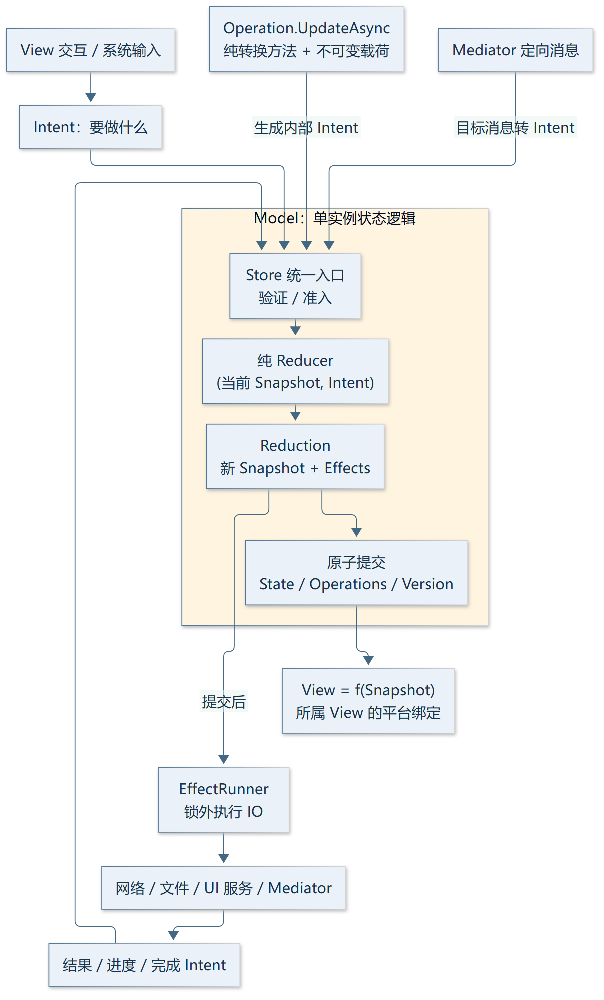
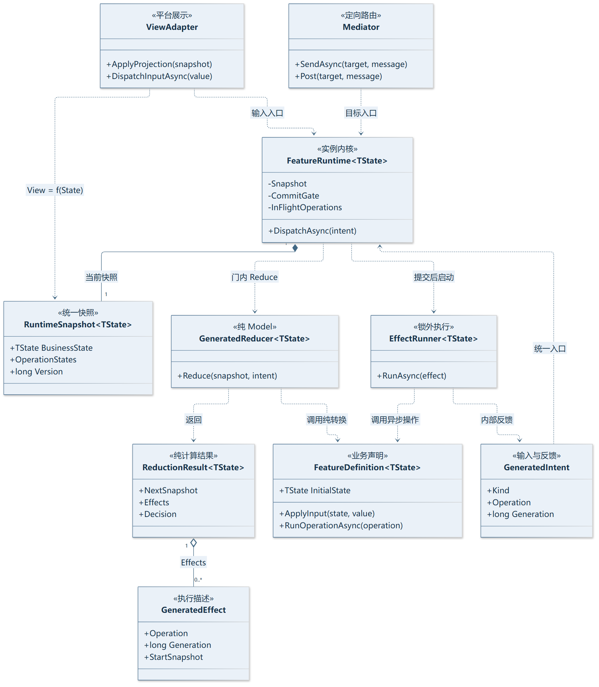
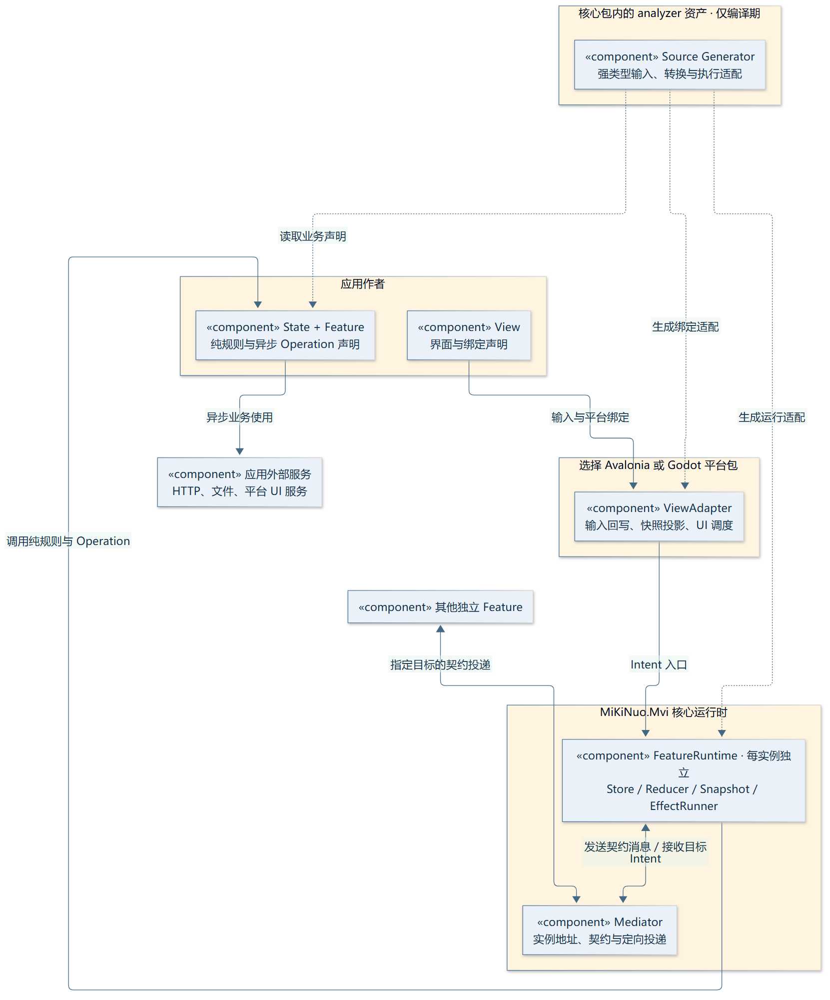
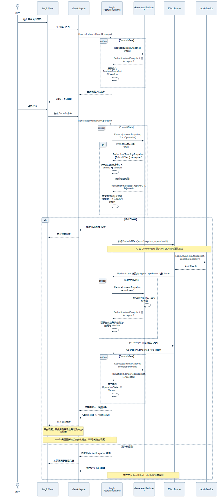
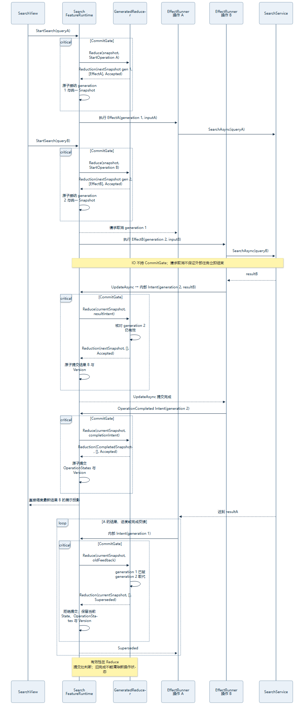
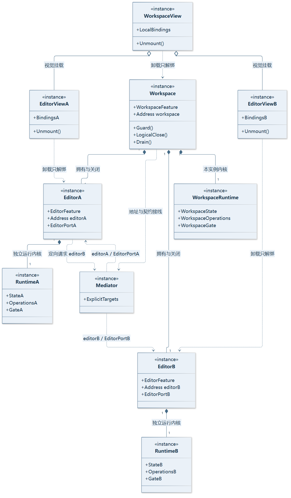
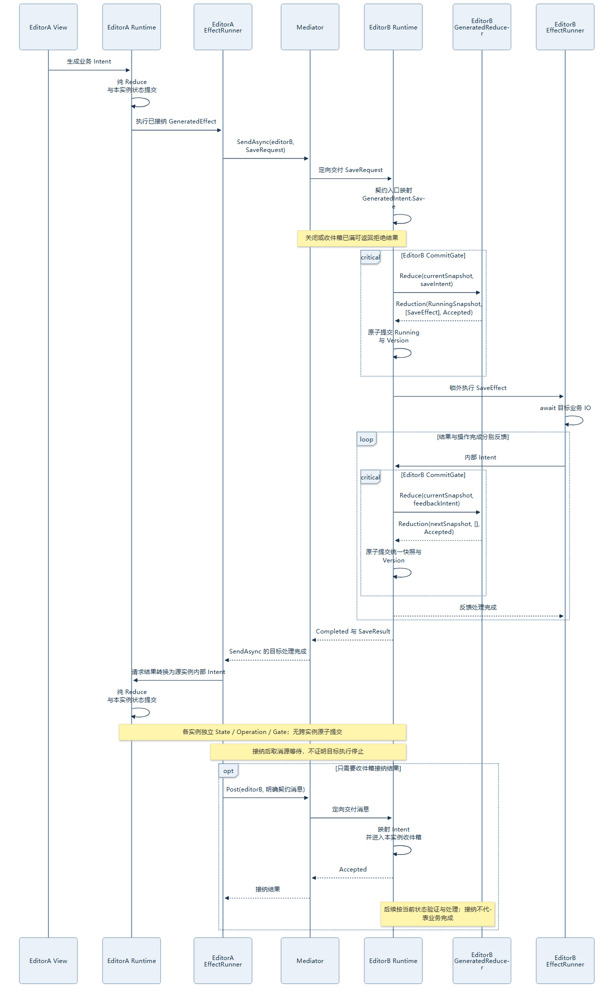
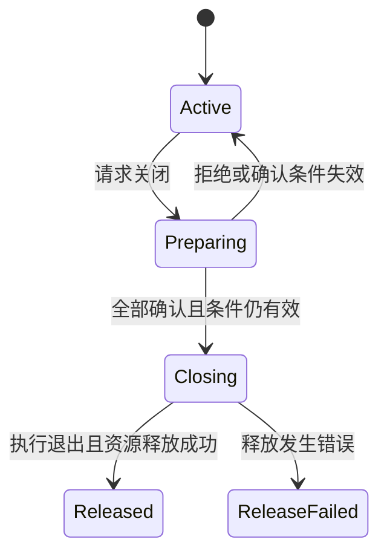
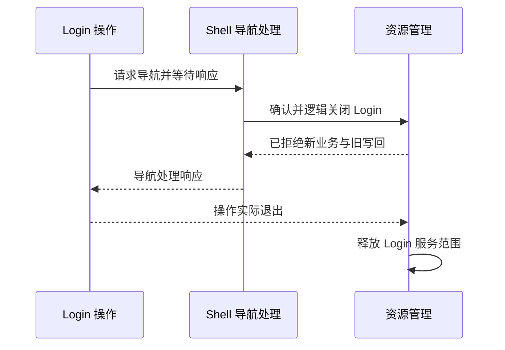

# MiKiNuo.Mvi v2 架构设计

状态：Q1～Q23 基础决策已接受；组合通信已按用户最新定义修订为无观察者订阅的中介者定向通信，见 ADR 0025。本文为完整设计基线草案，等待整体确认。日期：2026-10-01。

本文定义行为与职责，API 名称作为当前设计名称。示例中的 v2 类型尚未实现，当前分支源码仍是 v1 基线。领域术语见 [CONTEXT.md](CONTEXT.md)，讨论与逐轮决定见 [设计记录](../mvi-next-design.md)。

## 0. MVI 原理与本方案的角色映射

MVI 的核心是单向依赖闭环：Intent 将交互解释成意图，Model 根据意图演进状态，View 根据状态生成界面。原始定义使用流表达这三个过程；本框架采用 Store、纯 Reducer 和显式 Effect 描述实现同一职责边界。它们是具体实现选择，不要求业务作者逐一手写同名类。

核心关系：`View = f(Snapshot)`；`Reduce(Snapshot, Intent) -> (NextSnapshot, Effects, Decision)`；`Execute(Effect) -> FeedbackIntent`。快照包含业务 State、操作运行状态和版本，由同一提交协议维护。网络结果、进度、失败与操作结束也必须成为输入，不能在异步回调中绕过 Model 任意修改状态。

原稿主要列举生命周期与调用规则，没有清楚显示这些逻辑角色，也没有说明 Operation.UpdateAsync 对应哪条 MVI 路径。本版把它明确为内部强类型状态转换 Intent。异步 Operation 是副作用执行方法，纯转换仍在 Reducer 适配中运行。

依据：[André Staltz 的单向 UI 架构原文](https://staltz.com/unidirectional-user-interface-architectures.html)、[Cycle.js 官方 Model-View-Intent](https://cycle.js.org/model-view-intent.html)。本方案不采用 Cycle.js 的流订阅实现组合通信，而采用用户要求的中介者定向消息。

### 0.1 完整数据流



图中只有 Store/Model 的提交路径能够改变快照。EffectRunner 执行外部操作后产生新的 Intent，回到同一入口。Mediator 位于跨实例边界，目标消息仍进入接收方 Intent 入口。

[查看可缩放和追踪的数据流图](diagrams/mvi-closed-loop.html) · [编辑图源](diagrams/mvi-dataflow.mmd)

### 0.2 类型结构（UML 类图）



实心菱形表达拥有关系，虚线箭头表达使用依赖。FeatureRuntime 是单实例 Store/协调器；GeneratedReducer 使用业务声明中的纯方法；EffectRunner 使用异步 Operation 方法。RuntimeSnapshot<TState> 是渲染依据，ReductionResult 明确区分下一快照和待执行 Effect。

[UML 图源](diagrams/uml-types.mmd)

### 0.3 业务作者与内部角色

| MVI 角色 | 业务作者表达 | 运行时/生成器职责 |
| --- | --- | --- |
| Intent | Input 标记、调用 Operation、目标消息、IO 返回值 | 生成强类型输入/反馈描述，进入统一入口 |
| Model / Reducer | Feature 内纯转换、验证方法 | 将当前快照与 Intent 计算为 ReductionResult |
| State | State 类型与字段 | RuntimeSnapshot 包含业务 State、OperationStates、Version |
| Store | 普通作者无需独立声明 | FeatureRuntime 独占快照与短提交门 |
| Effect | Feature 内异步 Operation 方法 | Reduce 声明执行描述，提交后由 EffectRunner 运行 |
| View | 平台 View 与绑定 | 对所属快照投影、发出输入；不直接修改存储 |
| Mediator | 业务契约与宿主目标接线 | 定向消息映射目标 Intent，不承担业务转换 |

这套映射保持此前 State + Feature + View 的默认写法，同时让 Intent、Reduce、Effect 和 Render 的执行职责可辨认。事件溯源、持久化每个 Intent 或串行等待整个 IO 不属于本方案强制条件。

### 0.4 设计图索引

| 图 | 回答的问题 |
| --- | --- |
| [数据流图](diagrams/mvi-dataflow.svg) | 状态由谁改变，副作用结果怎样回流 |
| [UML 类图](diagrams/uml-types.svg) | 核心类型如何拥有和依赖彼此 |
| [组件图](diagrams/uml-components.svg) | 用户代码、生成器、运行时和平台包的边界 |
| [登录时序图](diagrams/login-sequence.svg) | 从输入到 HTTP 结果再到 View 的顺序 |
| [中介者时序图](diagrams/mediator-sequence.svg) | 不同子 View 怎样进入目标 MVI，而不订阅彼此 |
| [组合实例图](diagrams/composition-instances.svg) | 同类型子功能多开时哪些对象独立，谁管理关闭 |
| [Latest 时序图](diagrams/latest-sequence.svg) | 旧 IO 忽略取消时在哪个位置拒绝其结果 |

## 1. 目标与版本边界

- 同时覆盖复杂业务 UI 和游戏/实时交互 UI，以 Avalonia 与 Godot 验收。
- 普通功能默认由 State、Feature、View 三部分编写；跨功能协作另外定义显式业务契约。
- Feature 可独立运行、嵌入组合、同类型多开，组合支持动态增加、移除与嵌套；不同 View 和子 View 的业务通信经 Mediator 定向路由。
- 组合不实现观察者发布订阅，不要求子 View 订阅父级、兄弟或其他实例状态；本地展示使用平台绑定。
- 两种业务表达共用一个内核：纯状态转换，以及可等待 IO 的业务操作。
- `main` 保留 v1，归档标签 `archive/v1-2026-10-01` 固定提交 `ed77eb38ecba77a62fac2c0cbbbb35321a540d03`；v2 在默认分支 `codex/mvi-v2` 开发。
- 新版本不保留两套公开运行协议，不增加 v1 兼容对象图作为默认使用方式。

## 2. 架构结构



编译期虚线表示声明到生成资产的关系；运行时实线表示组件之间的调用或投递依赖。组件图只表达模块边界，完整的输入、状态提交和反馈路径见第 0.1 节数据流图。业务方法与生成适配构成 Model，FeatureRuntime 负责提交和协调，EffectRunner 不在提交门内等待 IO。

内核实现复用，但每个实例拥有独立 State、操作身份、准入状态、通信端点和生命周期。状态提交与投影调度按实例有序，不采用全局 Store 或全局业务队列。

对 View 可见的 Snapshot 是同一原子提交结果，包含业务 State、OperationStates 和 Version。IsRunning 等运行状态也通过内部 Intent/Reduce 演进，不能作为绕过提交协议的第二个可变状态源。

生成器产生强类型调用与适配。业务决定位于 Feature 的纯规则和业务操作中，平台代码负责展示、输入与 UI 调度，Mediator 负责路由和投递。

## 3. 包与源码职责

| 发布包 | 内容 | 常用安装入口 |
| --- | --- | --- |
| MiKiNuo.Mvi | 平台无关运行时、组合、通信、属性与命令契约；包含生成器编译资产 | 独立业务宿主与核心测试 |
| MiKiNuo.Mvi.Avalonia | Avalonia View、绑定、调度和生命周期适配，依赖核心包 | Avalonia 应用显式引用此包 |
| MiKiNuo.Mvi.Godot | Godot View、节点绑定、调度和生命周期适配，依赖核心包 | Godot 应用显式引用此包 |

源码按核心运行时、生成器、两个平台适配项目组织。Domain、Application、Presentation 的职责边界保留为核心内部模块；不再逐层发布独立 NuGet 包。测试与基准继续放在 test，示例放在 sample。

生成器独立编译，作为 analyzer 资产发布，不进入应用运行时对象图。平台包显式转递所需编译资产；同项目引用两平台时验证资产去重。应用仍自行提供平台宿主、主题等依赖。

核心内部模块：Runtime 管理状态与操作，Composition 管理实例、中介者目标路由和生命周期，Binding 管理平台无关投影与命令，Diagnostics 管理诊断、错误结果和日志。模块通过最小必要契约协作，不为每个内部类添加接口。

## 4. 业务作者的代码

### 4.1 输入与状态

State 默认只读。Input 标记可编辑字段，框架生成基本回写；需要附加规则时使用 OnInput 纯转换。派生属性或选择器仅由依赖变化触发有关展示更新。

```csharp
public sealed record LoginState
{
    [Input]
    public string UserName { get; init; } = string.Empty;

    [Input]
    public string Password { get; init; } = string.Empty;

    public string? DisplayName { get; init; }

    public string? ErrorMessage { get; init; }
}

public sealed partial class LoginFeature(IAuthService authService)
    : Feature<LoginState>(new())
{
    [OnInput(nameof(LoginState.UserName))]
    private static LoginState ChangeUserName(LoginState state, string value)
        => state with { UserName = value, ErrorMessage = null };

    [OnInput(nameof(LoginState.Password))]
    private static LoginState ChangePassword(LoginState state, string value)
        => state with { Password = value, ErrorMessage = null };

    [Operation(Validate = nameof(CanSubmit))]
    private async ValueTask<AuthResult> SubmitAsync(Operation<LoginState> operation)
    {
        LoginState input = operation.Snapshot;
        AuthResult result = await authService.LoginAsync(
            input.UserName,
            input.Password,
            operation.CancellationToken);

        await operation.UpdateAsync(ApplyLoginResult, result);
        return result;
    }

    private static bool CanSubmit(LoginState state)
        => !string.IsNullOrWhiteSpace(state.UserName)
            && !string.IsNullOrWhiteSpace(state.Password);

    private static LoginState ApplyLoginResult(LoginState state, AuthResult result)
        => state with
        {
            DisplayName = result.IsSuccess ? result.DisplayName : null,
            ErrorMessage = result.IsSuccess ? null : result.ErrorMessage ?? "登录失败。",
        };
}
```

IAuthService 与 AuthResult 是应用业务契约。示例包含输入规则、提交验证、外部调用与结果转换；导航另由业务操作或宿主契约表达。普通输入没有附加规则时可省略 OnInput。

### 4.2 生成表面与 View

| 用户声明 | 框架提供 |
| --- | --- |
| Input 字段 | 同名绑定属性、基本回写入口、变化通知与验证反馈 |
| 普通 State 属性 | 只读绑定投影 |
| Operation 方法 | 异步调用入口、命令、CanExecute、运行状态与执行结果 |
| 消息处理声明 | 强类型契约描述及目标处理适配 |
| Feature 类型 | 直接构造支持与标准 DI 创建工厂 |

例如 private SubmitAsync(Operation<LoginState>) 对应生成的 public SubmitAsync(CancellationToken) 和 SubmitCommand。编程调用获得 OperationResult<AuthResult>；View 绑定 SubmitCommand.IsRunning 显示 Loading，不手写 IsBusy 与结束处理。

View 绑定由平台适配创建独立投影和连接。每个 View 的连接在 UI 线程使用；Feature 业务对象不持有控件。状态、运行状态及命令可形成平坦绑定表面，用户不手写 ViewModel，也不调用 Subscribe。

本地绑定使用平台原生变化通知与生成的字段投影，不为每个字段创建 R3 订阅，不实现业务 State.Observable/Subscribe 入口。跨 View 的业务联系只能通过中介者消息表达，不能借本地绑定读取其他实例 State。

状态提交产生变化信息，框架直接调度所属 View 的本地适配更新；不以 Subject/Observable 的发布订阅管线驱动 v2 绑定。平台原生绑定本身使用的变化通知保留，由平台管理。

## 5. State 提交与验证协议

1. UI 输入、Operation 调用、Mediator 消息或 IO 反馈映射为 Intent，进入单实例 Store 入口。
2. 在短原子区间内检查生命周期、接纳边界、业务条件及并发策略，并取得一致快照。
3. GeneratedReducer 调用纯规则，返回下一 RuntimeSnapshot、Effect 描述与决定；规则故障保留原快照。
4. Store 提交下一快照与单调版本，再在门外直接调度所属平台展示。
5. EffectRunner 只执行提交后声明的 Effect；IO 不持提交门。
6. 执行结果、进度、业务状态转换和完成信息转换为反馈 Intent，重新执行步骤 1～4。

启动验证、并发准入和输入 Snapshot 采样必须在同一个短原子区间内完成。不能先验证一份状态，再把并发编辑后的另一份状态作为已验证输入交给 IO。

启动 Intent 与反馈 Intent 使用不同的规则。启动时验证当前业务条件，拒绝则不产生执行 Effect、不调用外部服务。反馈时核对实例生命周期、操作身份、generation 及结果应用规则；用户在 IO 期间继续编辑，不会使框架重新套用启动条件而错误丢弃合法完成。旧操作或关闭实例的反馈只能拒绝写回，不能撤销已经发生的 IO。

需要显示的验证反馈由 Reduce 写入 RuntimeSnapshot，再由 View 投影；不能仅根据 Rejected 返回值直接修改界面。拒绝尝试的反馈与当前有效执行的运行状态分别表达，重复点击被拒绝不能清除正在运行操作的 Busy。没有可见状态变化的拒绝可以保留原快照。

展示调度在提交门外仍须遵守版本单调性，不能因两个生产者并发而用旧版本覆盖新版本。业务定向消息使用有界接纳与背压，不静默丢弃；本地 UI 投影可按约定合并展示。框架不维护业务状态观察者列表或跨实例订阅图。

Snapshot 是 IO 输入；UpdateAsync 的转换参数是提交时的当前 State。不能用旧 Snapshot 整体替换当前状态，否则会覆盖并行编辑。Latest 的有效性校验在提交点完成，取消 token 本身不能证明结果有效。

业务验证覆盖 UI、编程调用与请求入口。CanExecute 是反馈，启动时验证是权威条件。编辑允许模型可表达的中间值；业务条件失败时不启动 IO，返回可识别的拒绝结果。

不可变约束覆盖可观察内容。record 或只读集合接口不自动证明嵌套对象不可变，状态表示、诊断与测试共同落实约束。子实例句柄与资源归属由组合运行时管理，不拼成共享可变业务 State。



SubmitRequested 的 Reduce 更新操作运行状态并声明 RunSubmit Effect，EffectRunner 调用服务。UpdateAsync 生成内部 ApplyTransition Intent，OperationCompleted 也以 Intent 回流。调用返回保证有关状态提交，不等待 UI 绘制。

## 6. Operation 协议

### 6.1 上下文与提交

Operation<TState> 是 Effect 执行上下文，提供开始时的 Snapshot、CancellationToken，以及反馈 Intent 派发和中介者定向消息入口。UpdateAsync 将纯转换标识与不可变载荷组成内部 Intent；成功返回表示该 Intent 已经 Reduce 并提交，或形成有效的无变化结果。它没有直接写 Store 的能力。

上下文失效时，更新不能正常成功返回后任由业务继续执行；应终止当前操作并映射为取消、被取代或实例已关闭等结果。通过框架发出的后续定向消息也在接纳点检查有效性。外部服务已经接纳的 IO 不自动撤销。

### 6.2 并发

| 策略 | 含义 |
| --- | --- |
| 默认拒绝重复 | 同实例、同操作已有执行时，新的调用不启动 |
| Latest | 新执行使旧执行失去有效性并请求取消，旧结果不得写回 |
| Queue | 有界顺序接纳，按声明策略执行，不隐藏队列已满的拒绝 |
| Parallel | 显式允许并行并设置接纳边界，状态提交仍有序 |

不同操作可以并行等待 IO。操作有效性不代替业务冲突判断：不同操作更新同一业务对象时，纯规则或业务服务仍须表达其一致性条件。



同操作新 generation 的接纳与输入快照采样原子完成。所有旧结果、进度和完成 Intent 都在目标 Reduce/提交点核验 generation，不能让旧操作把新操作的 Busy 状态清除。

### 6.3 结果

OperationResult<TResult> 区分 Completed、Rejected、Canceled、Superseded、Faulted；被取消的跨 Feature 等待另外表达为 WaitCanceled。结果提供原因、关联身份与可用的强类型业务值，不能把缺少完成结果当作业务成功。

正常 Completed 表示业务方法已结束，已接纳的状态变化已提交；不等待 UI 绘制。业务返回失败值仍可属于 Completed。取消不回滚此前已提交的变化，不提供跨时间或跨 Feature 的自动原子事务。

运行状态与结果分别定义：IsRunning、取消请求、当前有效执行、错误等通过结果、平台绑定和诊断表达；旧执行物理上尚未结束，不应覆盖 Latest 新执行的展示状态。框架继续跟踪所有仍访问资源的执行。

## 7. 调度与展示

- 业务操作默认后台执行；UI 服务经平台调度入口使用原生 UI 能力。
- UI 输入以强类型值进入实例入口，普通纯转换避免每次构造消息对象。
- View 使用生成的字段投影和平台本地绑定，默认合并等待中的 UI 更新，展示最新值。
- 需要中间展示状态时显式选择展示调度方式；中介者消息与一次性行为不使用展示合并策略。
- View 卸载释放本地绑定和输入连接，并使已排队的旧 View 回调失效；同一实例可重新挂载新 View。
- 同实例稳定挂载不重复创建视图或连接，跨实例挂载明确切换连接。

Loading 默认绑定指定操作运行状态，由 View 决定覆盖层或局部展示。背景刷新与提交可分别展示。非预期错误通过结构化结果、日志或明确错误处理入口报告，取消与普通业务失败分别表达。

## 8. 创建、DI 与所有权

直接 new 支持独立运行及测试。工厂通过标准 IServiceProvider 解析构造依赖，为实例创建独立 Scope；业务服务按应用注册的生命周期管理，外部手工传入的服务由其创建方拥有。

每次工厂创建都产生新业务实例及运行上下文。服务范围不形成父子 Feature 关系，所有权由宿主明确建立。构造依赖在创建阶段解析，状态和操作热路径不运行通用 DI 查找。

工厂负责它创建的范围；Feature 不作为同一范围中重复创建并参与自我递归释放的普通 scoped 服务。父级、活动子实例和仍在释放的资源分别跟踪。

直接构造实例的初始本地通信能力由内核提供；宿主把它加入明确组合范围并接线，才能依赖其他 Feature 契约。创建失败回收本次创建的对象和范围。

## 9. 动态组合与 Mediator



组合由独立实例形成，实例身份不同于业务对象 ID。同一数据可在两个独立编辑器实例中打开。宿主持有实例句柄用于挂载与生命周期，业务交互通过契约进行。

范围内请求有唯一提供方时自动绑定，多提供方明确选择实例或契约端口。可静态确定的歧义给编译诊断；动态缺少目标、歧义或目标关闭给明确运行结果，不能选择第一个候选。

所有业务消息定向投递；框架不按通知类型寻找订阅者，也不维护 Publish/Subscribe API。跨范围由宿主接线，独立宿主可提供同一契约的实现，子 Feature 不依赖父级或兄弟类型。

Mediator 只完成目标确定与交付，消息由目标契约适配映射 Intent。它不能直接调用接收方私有业务方法或直接写入接收方 State。

药品查询子 View 的选择交互进入其 Feature，通过 Mediator 将 ShowDrug 消息送给明确的详情 Feature；详情实例执行规则、更新自己的 State，其 View 由本地绑定展示。查询子 View 不观察详情状态，详情子 View 不订阅查询状态。

需要更新多个子功能时，组合协调者根据业务流程向明确目标逐个或并行发送。此处接线表示消息地址，不表示建立消息主题或观察者关系。

## 10. 定向消息、处理完成与取消



| 场景 | 返回含义 |
| --- | --- |
| 请求正常响应 | 目标处理结束，目标所接纳的有关状态变化已提交 |
| 请求未接纳 | 未启动，原因可识别 |
| 目标接纳后取消等待 | 调用者不再等待，不证明目标停止；没有正常业务响应 |
| 定向 Post/TryPost | 指定目标收件箱的接纳报告，不证明业务处理完成 |
| 定向消息后续处理失败 | 通过结果、日志或明确错误处理入口报告，并与来源关联 |

请求接纳前取消不启动；接纳后默认由目标管理执行。请求契约可声明传播协作取消，等待取消与执行取消始终分开观察。发起者关闭不撤销目标已发生的外部操作或已提交状态。

SendAsync 等待指定目标处理完成，Post/TryPost 只等待或取得指定目标接纳。两者复用实例已有准入、验证与执行协议；不为每个消息类型或订阅者创建独立队列。目标实例收件箱在关闭、已满等情况下明确拒绝。

Post 的接纳只保证消息进入指定目标处理入口，启动校验仍按处理时的状态执行；后续验证拒绝或执行失败通过确定的结果记录、日志或错误处理入口报告。框架不为这些报告建立观察者订阅通道。

Mediator 保存实例地址、契约处理描述和宿主明确的路由表；发送时查找确定目标并进入该实例处理入口，不创建观察者回调。独立实例之间没有原子状态提交，整体保存由业务协调与后端事务保证。

## 11. 关闭协议



### 11.1 准备与逻辑关闭

关闭确认覆盖整个所有权范围。准备阶段不提前取消其他子实例 IO 或释放资源；任一拒绝时恢复可用。记录业务状态与成员条件，条件失效则重验证。

最终提交关闭须有明确线性化点：成员关系稳定，相关实例停止新业务与迟到写回后才发出不可撤销的取消和释放动作。实现不能逐个取消后再发现另一实例拒绝。确认调用等待与实际关闭流程也分别定义。

### 11.2 公开关闭表面

RequestCloseAsync 返回 CloseResult，区分拒绝、等待取消、失败和已逻辑关闭。逻辑关闭成功时提供 CloseTicket；CloseTicket.Released 独立表示资源释放完成，失败可观察。

View 在逻辑关闭后可卸载。仍使用范围的执行真正退出后才释放 Scope。已移出活动组合的实例保留资源释放跟踪；父级/宿主最终释放须考虑这些执行。

资源释放等待可超时或被取消，但实例仍处于释放中；不得据此强制释放仍在访问的对象。程序结束前的宿主最终清理与交互式关闭分别使用正确阶段。

### 11.3 等待环检验



导航响应不等待发起者退出。等待释放的调用链不得依赖被等待实例的执行；检测明确的自等待/依赖等待，并给诊断或运行错误。

框架跟踪它接纳的执行；使用实例资源的异步工作必须被等待或纳入跟踪，不允许无归属的 fire-and-forget 工作被当作已结束。

## 12. 生成器与诊断

- 从声明属性和明确类型关系发现候选，增量生成稳定模型，不扫描整个 Compilation 寻找所有普通业务类型。
- 生成构造工厂、输入回写、命令包装、分派、接线描述、字段投影与平台桥接。
- 不生成通用服务容器，不依命名排序猜测请求目标。
- 方法签名、重复处理器、成员冲突、纯转换边界、无效绑定和跨实例业务直连等误用给明确诊断。
- 默认消费者诊断不强制项目分层命名或中文文档风格；框架仓库自身继续遵守工程规范。
- 调用、生成器错误和运行故障可定位原始业务声明。追踪记录实例、操作、版本、来源与结果；敏感业务参数不作为默认日志载荷。

## 13. 必须通过的验收场景

| 场景 | 可判定结果 |
| --- | --- |
| 基本字段与附加转换 | 字段声明一次；基本回写有效；额外规则仅在有关字段运行 |
| 所有启动入口验证 | UI、编程与 Mediator 的启动 Intent 都走同一验证，拒绝时不产生执行 Effect、服务未调用 |
| 反馈有效性验证 | IO 结果、进度与完成 Intent 核对操作身份和生命周期；拒绝不写状态，不宣称撤销已经发生的 IO |
| 验证反馈展示 | 可见拒绝原因来自已提交 Snapshot；被拒绝的新尝试不覆盖当前有效操作的运行状态 |
| 副作用回流 | UpdateAsync、结果、进度与完成不能直接改 Store，全部映射反馈 Intent |
| 快照单一权威 | 业务状态与操作状态在同一 RuntimeSnapshot 提交，不呈现不同版本组合 |
| 验证期间并发输入 | 启动条件与实际输入 Snapshot 一致，不能以旧验证启动新输入 |
| 慢登录与其他输入 | IO 等待不阻塞其他合法输入，Loading 正确开始和结束 |
| 连续搜索 A/B | A 晚到或忽略取消也不能覆盖 B，不覆盖其运行状态 |
| 并发提交与展示 | 状态版本单调，旧展示更新不能覆盖新值，无门内平台回调和死锁 |
| 定向消息队列已满/关闭 | 报告接纳拒绝；后续失败通过结果或诊断报告 |
| 多子 View 业务通信 | 定向中介者处理，无 Subscribe/Publish、主题和订阅者列表 |
| 请求等待取消 | 等待结束不被误报为目标结束或业务撤销 |
| 相同类型实例多开 | State、操作和实例路由隔离，独立复用同一业务代码 |
| View 卸载再挂载 | 实例状态保留，旧本地绑定与旧回调失效，不重复连接 |
| 子实例独立关闭 | 活动成员和路由移除，父级后续关闭正常，释放仍被跟踪 |
| 一个子实例拒绝关闭 | 整个组合仍可用，其他 IO 未被提前取消 |
| 确认期间状态/成员变化 | 旧确认不可直接提交关闭，重新验证 |
| 导航关闭发起者 | 响应能返回，无相互等待，资源在实际退出后释放 |
| 不合作 IO 与释放超时 | 逻辑关闭有效，资源继续保留并跟踪，不假报释放成功 |
| 高频 HUD 与大页面 | 业务不丢失，UI 有关字段更新，展示合并与线程正确 |
| NuGet 单平台独立消费 | 仅引用平台入口包即可获得核心与生成代码，平台宿主正常运行 |
| 双平台/独立业务消费 | 编译资产去重，无 GUI 核心能独立运行和测试 |

## 14. 性能证明

同环境、同状态表示、等价语义比较最小手写实现、归档 v1、v2；创建与 DI 加标准 DI 对照。报告中位成本、尾延迟、分配、实例路由及绑定/范围释放与 UI 工作量。

子 View 数量增长时验证路由记录、平台绑定连接与消息处理成本；跨 View/Feature 观察者订阅数量始终为零，不为每个字段建立框架 R3 订阅。

纯转换避免每次消息包装、反射或 DI 查找，框架额外分配与业务 State 创建分开统计。复杂优化、池化和额外缓存仅在数据证明需要时引入。

创建和多实例测量、两平台 UI 测量、冷/增量生成测量分别执行。计时回归重复确认；稳定泄漏、错写、丢失事件与取消误判为硬失败。历史纳秒数字不作为当前测量结果，数值预算从固定负载测量建立。

## 15. 实施顺序与停止条件

1. 核心实例、状态提交、验证、操作身份与结构化结果；用纯转换、并发与 Latest 行为测试证明协议。
2. 增量生成输入、操作、绑定描述与标准 DI 工厂；用用户声明到生成入口的消费测试证明三部分写法。
3. 动态组合、中介者定向路由、有界实例收件箱、等待/执行取消与关闭票据；覆盖关闭拒绝、成员变更及等待环。
4. Avalonia 与 Godot 适配；完成真实输入、Loading、卸载重挂载、多开编辑器与高频 HUD 验收。
5. 三包发行、独立消费者、基准与增量构建证明；统一正式、预览和本地打包入口。
6. 删除被替代的 v1 对象图、生成容器、角色样板与样例路径，更新工程标准和文档，确认新分支只保留一套 v2 默认协议。

各步先证明必要行为再扩展，复用已有测试工具和基准，不以绿色构建代替功能验收。所有上述场景通过、包消费有效、四类成本有测量、最终 diff 与 v2 目标一致后停止。

## 16. 依据与确认

架构决定见 [ADR 0009～0026](../adr/)，组合通信以 [ADR 0025](../adr/0025-vnext-mediator-without-observer-subscriptions.md) 为准，MVI 角色与闭环映射见 [ADR 0026](../adr/0026-vnext-explicit-mvi-role-mapping.md)。标准库边界参考 [DI 释放指南](https://learn.microsoft.com/en-us/dotnet/core/extensions/dependency-injection-guidelines)、[协作取消](https://learn.microsoft.com/en-us/dotnet/standard/threading/cancellation-in-managed-threads)、[Task.WaitAsync](https://learn.microsoft.com/en-us/dotnet/api/system.threading.tasks.task.waitasync?view=net-10.0)。

Q1～Q23 已接受。本文把决定整合为可实施的协议与验收基线；整体确认后进入实现，具体代码名字或优化细节在保持协议的前提下按证据调整。

2026-10-01 原版独立只读架构审查通过。其后组合通信按 ADR 0025 修订为无订阅中介者模式，修订版亦通过独立只读复核：明确目标路由、多目标协调分派、实例收件箱和平台本地绑定边界一致，不是将观察者改名。运行时与性能仍由实现后的验收场景证明。
